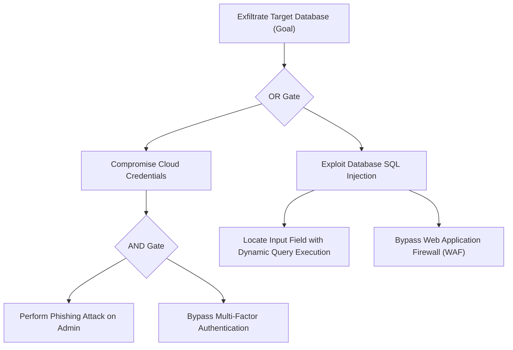

# Project Venus USPTCROS — Part 06: Attack Trees

## 1. Executive Summary
Attack trees are mathematical and graphical structures used to represent system attacks. They allow security engineers to analyze how a logical combination of lower-level exploits leads to a system-level breach.

## 2. Mathematical Evaluation of Gates
Attack trees utilize logical gates (AND, OR) to combine individual node probabilities and costs.

### 2.1 Probability Calculations
- **OR Gate**: The parent node succeeds if *any* child node succeeds.
  $$P(\text{Parent}) = 1 - \prod_{i=1}^n (1 - P(c_i))$$
- **AND Gate**: The parent node succeeds only if *all* child nodes succeed.
  $$P(\text{Parent}) = \prod_{i=1}^n P(c_i)$$

### 2.2 Cost Calculations
- **OR Gate**: The cheapest path determines the cost.
  $$C(\text{Parent}) = \min_{i=1}^n C(c_i)$$
- **AND Gate**: The sum of all paths determines the cost.
  $$C(\text{Parent}) = \sum_{i=1}^n C(c_i)$$

---

## 3. Threat Tree Representation (Database Exfiltration Example)


---

## 4. Attack Tree JSON Validation Schema
```json
{
  "$schema": "http://json-schema.org/draft-07/schema#",
  "title": "VenusAttackTree",
  "type": "object",
  "properties": {
    "goal": { "type": "string" },
    "node_id": { "type": "string" },
    "gate_type": { "type": "string", "enum": ["AND", "OR", "LEAF"] },
    "probability": { "type": "number", "minimum": 0.0, "maximum": 1.0 },
    "cost": { "type": "number", "minimum": 0.0 },
    "children": {
      "type": "array",
      "items": { "$ref": "#" }
    }
  },
  "required": ["goal", "node_id", "gate_type", "probability", "cost"]
}
```

---

## 5. Absolute System Links
- **Previous Chapter**: [Part 05: PASTA](file:///Users/dronpancholi/Developer/01_Strategic/Venus/usptcros_parts/PART_05_PASTA.md)
- **Next Chapter**: [Part 07: Kill Chains](file:///Users/dronpancholi/Developer/01_Strategic/Venus/usptcros_parts/PART_07_KILL_CHAINS.md)
