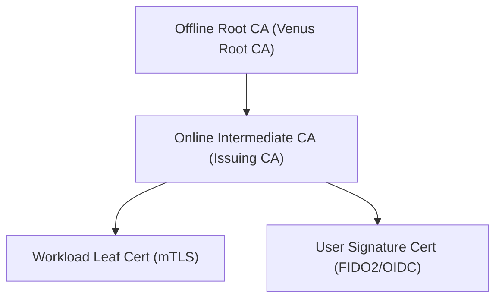

# Project Venus USPTCROS — Part 17: Public Key Infrastructure (PKI)

## 1. Executive Summary
This chapter defines the engineering standards for the Public Key Infrastructure (PKI) of Project Venus. It outlines the hierarchy, certificate profile constraints, and signing workflows.

## 2. Certificate Authority (CA) Hierarchy
Venus operates a multi-tier CA hierarchy to isolate the root of trust:



---

## 3. OpenSSL Secure Certificate Signing Request Configuration
The following configuration template enforces secure extensions and SAN parameters for generating workload certificates.

```ini
[ req ]
default_bits        = 4096
default_md          = sha384
distinguished_name  = req_distinguished_name
req_extensions      = v3_req
prompt              = no

[ req_distinguished_name ]
C                   = US
O                   = Project Venus
CN                  = payment-service.venus.local

[ v3_req ]
basicConstraints    = CA:FALSE
keyUsage            = digitalSignature, keyEncipherment
extendedKeyUsage    = clientAuth, serverAuth
subjectAltName      = @alt_names

[ alt_names ]
DNS.1               = payment-service.venus.local
DNS.2               = payment-service.prod.svc.cluster.local
URI.1               = spiffe://venus.local/ns/prod/sa/payment-service
```

---

## 4. PKI Audit Checklist
- [ ] Verify that the Root CA private key is stored offline on hardware security modules (HSM) and never accessed except during intermediate CA renewal.
- [ ] Enforce that Intermediate CAs are configured with strict path-length constraints (`pathlen:0`).
- [ ] Audit leaf certificate expiration parameters to ensure they do not exceed 30 days.
- [ ] Ensure that certificate revocation checks (CRL or OCSP) are enforced at all ingress controllers.

---

## 5. Absolute System Links
- **Previous Chapter**: [Part 16: Cryptography](file:///Users/dronpancholi/Developer/01_Strategic/Venus/usptcros_parts/PART_16_CRYPTOGRAPHY.md)
- **Next Chapter**: [Part 18: Certificate Lifecycle](file:///Users/dronpancholi/Developer/01_Strategic/Venus/usptcros_parts/PART_18_CERTIFICATE_LIFECYCLE.md)
