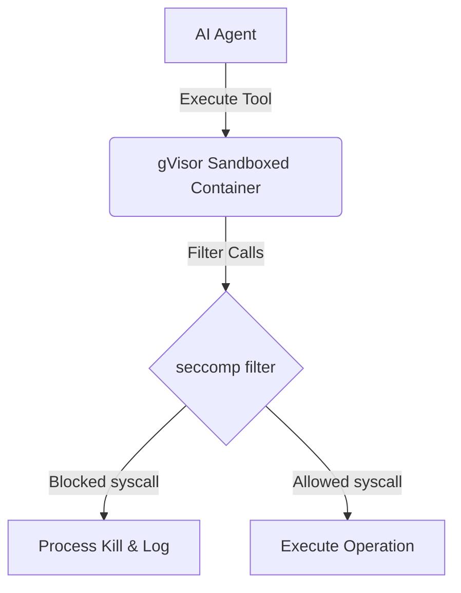

# Agent Tool Isolation and Sandbox Policy
**Document ID:** VENUS-USPTCROS-095
**Version:** 1.0.0
**Status:** Approved
**Effective Date:** 2026-06-26

## 1. Overview & Objective
Enforces runtime containment, execution limitations, and access rules for tool systems executed by autonomous AI agents, mitigating threat escalation.

## 2. Technical Specifications & Architecture


## 3. Code Fragment / Implementation Details
```yaml
# Sandboxed tool configuration definition
runtime: gvisor
seccomp_profile:
  default_action: ERRNO
  syscalls:
    - name: write
      action: ALLOW
    - name: read
      action: ALLOW
network_access: SandboxIsolated
read_only_root_filesystem: True
```

## 4. Verification Schema & Configurations
```json
{
  "$schema": "http://json-schema.org/draft-07/schema#",
  "title": "ToolIsolationSpec",
  "type": "object",
  "properties": {
    "tool_name": {
      "type": "string"
    },
    "isolation_runtime": {
      "type": "string",
      "enum": [
        "gvisor",
        "seccomp",
        "docker"
      ]
    },
    "network_access_allowed": {
      "type": "boolean"
    },
    "restricted_syscalls": {
      "type": "array",
      "items": {
        "type": "string"
      }
    }
  },
  "required": [
    "tool_name",
    "isolation_runtime",
    "network_access_allowed"
  ]
}
```

## 5. Mathematical Formulations & Quantitative Metrics
$$SandboxLevel = \frac{EnforcedSyscalls}{TotalRequestedSyscalls} \times 100$$

## 6. Institutional Verification Checklist
* [ ] Run all agent-executable tools within microVMs or sandboxes.
* [ ] Enforce read-only root filesystems for all tools.
* [ ] Configure seccomp profiles to block execution of dangerous syscalls (e.g. execve).
* [ ] Block outbound network connectivity within tool runtime sandboxes.

## 7. Cross-References
- [Llm Prompt Injection Defense](file:///Users/dronpancholi/Developer/01_Strategic/Venus/usptcros_templates/LLM_PROMPT_INJECTION_DEFENSE.md)
- [Mcp Server Permission Schema](file:///Users/dronpancholi/Developer/01_Strategic/Venus/usptcros_templates/MCP_SERVER_PERMISSION_SCHEMA.md)
- [Ai Agent Execution Audit Log](file:///Users/dronpancholi/Developer/01_Strategic/Venus/usptcros_templates/AI_AGENT_EXECUTION_AUDIT_LOG.md)
