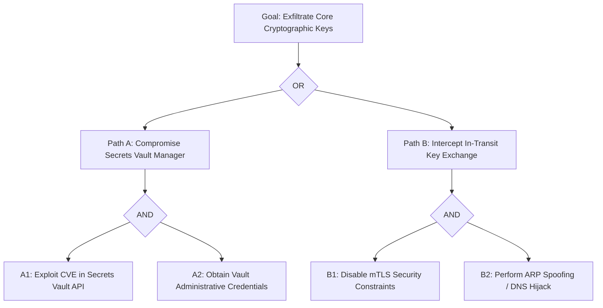

# USPTCROS Attack Tree Diagram Spec
**Document Link:** [Attack Tree Diagram](file:///Users/dronpancholi/Developer/01_Strategic/Venus/usptcros_templates/ATTACK_TREE_DIAGRAM.md)  
**Target Schema:** [Attack Tree Node Schema](file:///Users/dronpancholi/Developer/01_Strategic/Venus/usptcros_templates/ATTACK_TREE_NODE_SCHEMA.md)

## 1. Attack Tree Structural Representation
Below is the structural attack tree for compromising the Project Venus core cryptographic keys.

## 2. Quantitative Attack Path Metrics
| Node ID | Threat Goal | Probability | Attacker Cost | Estimated Difficulty | Active Mitigation |
|---|---|---|---|---|---|
| A1 | Exploit Secrets Vault API | Low (0.15) | High ($50k) | Expert | Regular vulnerability scanning & patching. |
| A2 | Obtain Vault Credentials | Med (0.35) | Low ($5k) | Medium | Hardened MFA and short-lived admin sessions. |
| B1 | Disable mTLS Security | Low (0.05) | High ($100k) | Expert | Cryptographic validation at the host level. |
| B2 | DNS Hijacking | Med (0.40) | Med ($15k) | Medium | DNSSEC validation & static routing configs. |

## 3. Node Calculation Formulas
For any combined AND gate, the joint probability is calculated as:
$$P(AND) = \prod_{i=1}^{n} P(SubGoal_i)$$

For any OR gate, the combined probability of failure is:
$$P(OR) = 1 - \prod_{i=1}^{n} (1 - P(SubGoal_i))$$
