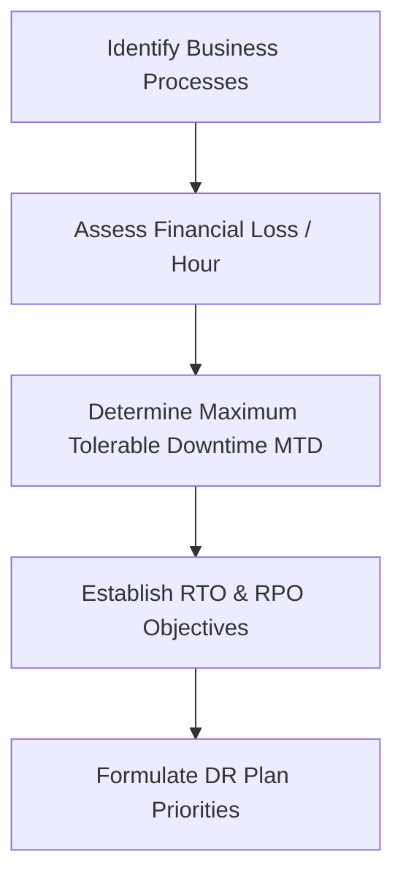

# Business Impact Analysis (BIA) Report
**Document ID:** VENUS-USPTCROS-138
**Version:** 1.0.0
**Status:** Approved
**Effective Date:** 2026-06-26

## 1. Overview & Objective
Establishes templates and evaluation matrices to determine the operational and financial impacts of outages on critical business systems.

## 2. Technical Specifications & Architecture


## 3. Code Fragment / Implementation Details
```yaml
bia_metrics:
  critical_processes:
    - name: "Transaction processing API"
      financial_loss_per_hour_usd: 150000
      max_tolerable_downtime_minutes: 30
      rto_minutes: 15
      rpo_minutes: 5
```

## 4. Verification Schema & Configurations
```json
{
  "$schema": "http://json-schema.org/draft-07/schema#",
  "title": "BIAReportSchema",
  "type": "object",
  "properties": {
    "assessed_at": {
      "type": "string",
      "format": "date-time"
    },
    "financial_loss_threshold": {
      "type": "number"
    },
    "critical_systems": {
      "type": "array",
      "items": {
        "type": "string"
      }
    }
  },
  "required": [
    "assessed_at",
    "financial_loss_threshold",
    "critical_systems"
  ]
}
```

## 5. Mathematical Formulations & Quantitative Metrics
$$FinancialLoss = HoursOutage \times CostPerHour$$

## 6. Institutional Verification Checklist
* [ ] Survey business department heads to identify critical operational processes.
* [ ] Quantify the potential financial losses associated with system downtime.
* [ ] Calculate Maximum Tolerable Downtime (MTD) metrics for core systems.
* [ ] Verify RTO and RPO objectives align with the Disaster Recovery plan.

## 7. Cross-References
- [Disaster Recovery Plan](file:///Users/dronpancholi/Developer/01_Strategic/Venus/usptcros_templates/DISASTER_RECOVERY_PLAN.md)
- [Cyber Resilience Steady State](file:///Users/dronpancholi/Developer/01_Strategic/Venus/usptcros_templates/CYBER_RESILIENCE_STEADY_STATE.md)
- [Vendor Alternate Sourcing Matrix](file:///Users/dronpancholi/Developer/01_Strategic/Venus/usptcros_templates/VENDOR_ALTERNATE_SOURCING_MATRIX.md)
