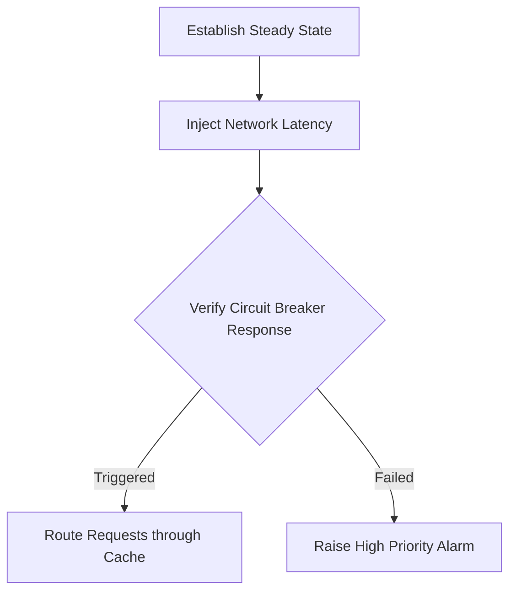

# Chaos Injection Drill Report
**Document ID:** VENUS-USPTCROS-147
**Version:** 1.0.0
**Status:** Approved
**Effective Date:** 2026-06-26

## 1. Overview & Objective
Establishes reporting templates, metrics, and configurations to run chaos injection experiments (such as killing pods or injecting latency) and evaluate system responses.

## 2. Technical Specifications & Architecture


## 3. Code Fragment / Implementation Details
```yaml
apiVersion: chaos-mesh.org/v1alpha1
kind: NetworkChaos
metadata:
  name: network-latency-injection
  namespace: venus-production
spec:
  action: delay
  mode: one
  selector:
    namespaces:
      - venus-production
    labelSelectors:
      app: core-api
  delay:
    latency: '150ms'
    correlation: '50'
  duration: '5m'
```

## 4. Verification Schema & Configurations
```json
{
  "$schema": "http://json-schema.org/draft-07/schema#",
  "title": "ChaosExperimentReport",
  "type": "object",
  "properties": {
    "drill_id": {
      "type": "string"
    },
    "experiment_type": {
      "type": "string"
    },
    "steady_state_maintained": {
      "type": "boolean"
    }
  },
  "required": [
    "drill_id",
    "experiment_type",
    "steady_state_maintained"
  ]
}
```

## 5. Mathematical Formulations & Quantitative Metrics
$$SystemResilience = \frac{SuccessfulRequests_{during\_chaos}}{TotalRequests_{during\_chaos}} \times 100\%$$

## 6. Institutional Verification Checklist
* [ ] Run chaos experiments in staging environments first.
* [ ] Verify steady state metrics remain within boundaries.
* [ ] Confirm network circuit breakers trigger on increased latency.
* [ ] Record experiment results and findings in the central repository.

## 7. Cross-References
- [Ha Database Failover Checklist](file:///Users/dronpancholi/Developer/01_Strategic/Venus/usptcros_templates/HA_DATABASE_FAILOVER_CHECKLIST.md)
- [Crisis Management Command Structure](file:///Users/dronpancholi/Developer/01_Strategic/Venus/usptcros_templates/CRISIS_MANAGEMENT_COMMAND_STRUCTURE.md)
- [Cyber Resilience Steady State](file:///Users/dronpancholi/Developer/01_Strategic/Venus/usptcros_templates/CYBER_RESILIENCE_STEADY_STATE.md)
