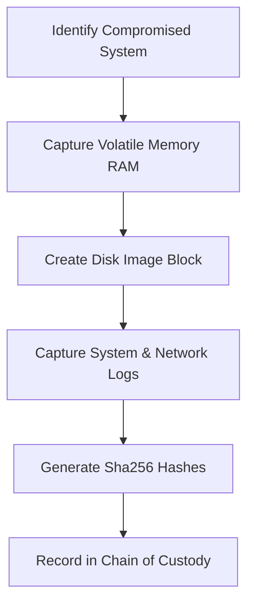

# Digital Forensics Collection Runbook
**Document ID:** VENUS-USPTCROS-125
**Version:** 1.0.0
**Status:** Approved
**Effective Date:** 2026-06-26

## 1. Overview & Objective
Defines procedures for gathering system images, system logs, memory files, and configuration data while maintaining forensic integrity.

## 2. Technical Specifications & Architecture


## 3. Code Fragment / Implementation Details
```bash
#!/usr/bin/env bash
# Collect host processes and connections forensically
set -euo pipefail

DEST_DIR="/mnt/forensics_evidence/$(date +%Y%m%d_%H%M%S)"
mkdir -p "${DEST_DIR}"

echo "Collecting process lists..."
ps auxww > "${DEST_DIR}/process_list.txt"

echo "Collecting active network socket records..."
ss -apn > "${DEST_DIR}/network_sockets.txt"

echo "Generating SHA-256 hashes..."
sha256sum "${DEST_DIR}/process_list.txt" > "${DEST_DIR}/process_list.txt.sha256"
sha256sum "${DEST_DIR}/network_sockets.txt" > "${DEST_DIR}/network_sockets.txt.sha256"
```

## 4. Verification Schema & Configurations
```json
{
  "$schema": "http://json-schema.org/draft-07/schema#",
  "title": "ForensicEvidenceSpec",
  "type": "object",
  "properties": {
    "source_host_id": {
      "type": "string"
    },
    "collected_by": {
      "type": "string"
    },
    "evidence_files": {
      "type": "array",
      "items": {
        "type": "object",
        "properties": {
          "file_path": {
            "type": "string"
          },
          "sha256": {
            "type": "string",
            "pattern": "^[a-f0-9]{64}$"
          }
        },
        "required": [
          "file_path",
          "sha256"
        ]
      }
    }
  },
  "required": [
    "source_host_id",
    "collected_by",
    "evidence_files"
  ]
}
```

## 5. Mathematical Formulations & Quantitative Metrics
$$EvidenceHashVerification = \text{Match}(\text{Hash}_{capture}, \text{Hash}_{ingestion})$$

## 6. Institutional Verification Checklist
* [ ] Gather volatile memory before powering down or restarting systems.
* [ ] Generate cryptographic hashes for all collected evidence files.
* [ ] Record collection metadata details in the Chain of Custody log.
* [ ] Store evidence files on dedicated, read-only storage media.

## 7. Cross-References
- [Forensic Chain Of Custody Form](file:///Users/dronpancholi/Developer/01_Strategic/Venus/usptcros_templates/FORENSIC_CHAIN_OF_CUSTODY_FORM.md)
- [Memory Dump Forensic Spec](file:///Users/dronpancholi/Developer/01_Strategic/Venus/usptcros_templates/MEMORY_DUMP_FORENSIC_SPEC.md)
- [Host Incident Investigation Guide](file:///Users/dronpancholi/Developer/01_Strategic/Venus/usptcros_templates/HOST_INCIDENT_INVESTIGATION_GUIDE.md)
