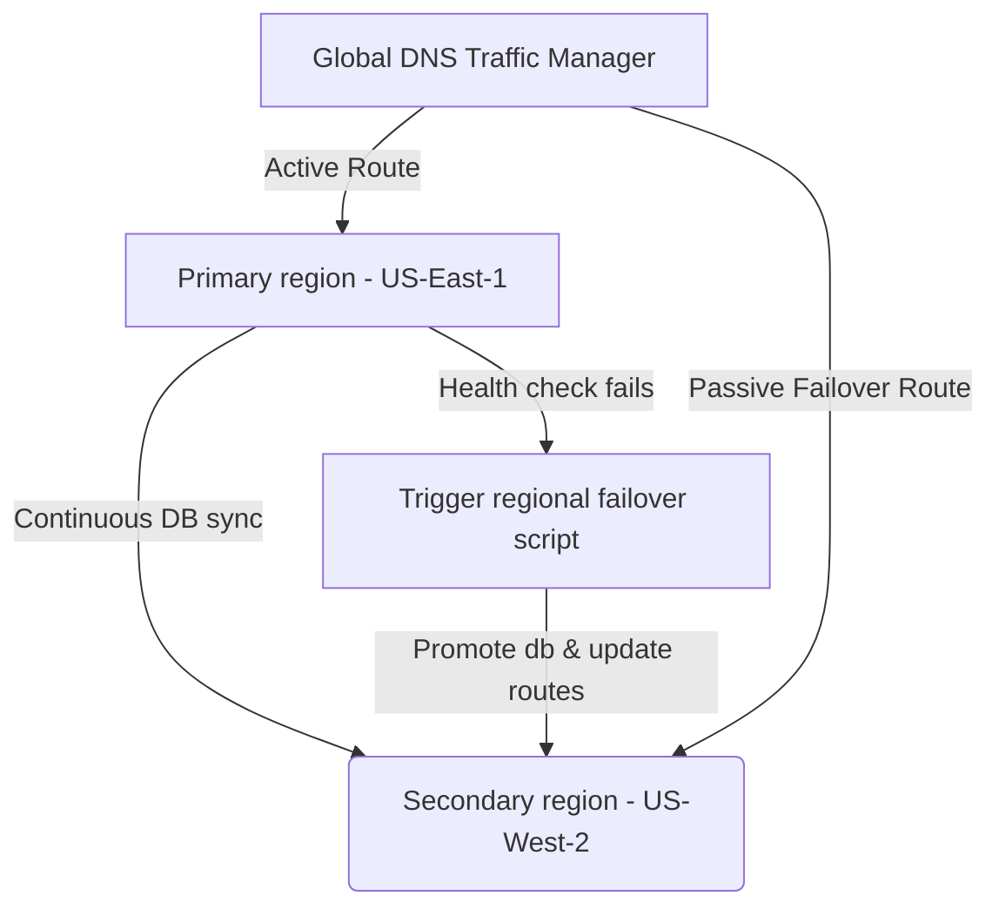

# Disaster Recovery Plan (DRP)
**Document ID:** VENUS-USPTCROS-136
**Version:** 1.0.0
**Status:** Approved
**Effective Date:** 2026-06-26

## 1. Overview & Objective
Defines recovery architectures, target recovery timelines (RTO/RPO), regional failover workflows, and data replication procedures.

## 2. Technical Specifications & Architecture


## 3. Code Fragment / Implementation Details
```yaml
dr_plan:
  target_rto_minutes: 15
  target_rpo_minutes: 5
  primary_region: "us-east-1"
  recovery_region: "us-west-2"
  database_failover_mechanism: "Patroni-LogicalReplication"
```

## 4. Verification Schema & Configurations
```json
{
  "$schema": "http://json-schema.org/draft-07/schema#",
  "title": "DRPlanConfig",
  "type": "object",
  "properties": {
    "target_rto_minutes": {
      "type": "integer",
      "maximum": 120
    },
    "target_rpo_minutes": {
      "type": "integer",
      "maximum": 60
    },
    "primary_region": {
      "type": "string"
    },
    "recovery_region": {
      "type": "string"
    }
  },
  "required": [
    "target_rto_minutes",
    "target_rpo_minutes",
    "primary_region",
    "recovery_region"
  ]
}
```

## 5. Mathematical Formulations & Quantitative Metrics
$$RTO = T_{available} - T_{failure}$$
$$RPO = T_{failure} - T_{last\_backup}$$

## 6. Institutional Verification Checklist
* [ ] Initiate replication routines for databases.
* [ ] Verify database consistency prior to updating traffic routes.
* [ ] Update DNS configurations to point traffic to the alternate region.
* [ ] Verify application services are running on the recovery cluster.

## 7. Cross-References
- [Business Continuity Plan](file:///Users/dronpancholi/Developer/01_Strategic/Venus/usptcros_templates/BUSINESS_CONTINUITY_PLAN.md)
- [Business Impact Analysis Report](file:///Users/dronpancholi/Developer/01_Strategic/Venus/usptcros_templates/BUSINESS_IMPACT_ANALYSIS_REPORT.md)
- [Rto Validation Metrics](file:///Users/dronpancholi/Developer/01_Strategic/Venus/usptcros_templates/RTO_VALIDATION_METRICS.md)
