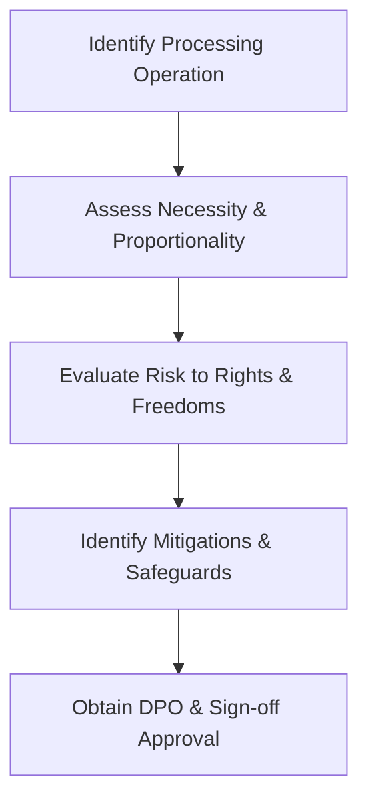

# Data Protection Impact Assessment (DPIA) Specification
**Document ID:** VENUS-USPTCROS-107
**Version:** 1.0.0
**Status:** Approved
**Effective Date:** 2026-06-26

## 1. Overview & Objective
Defines parameters for conducting Data Protection Impact Assessments (DPIAs) under GDPR Article 35 for high-risk processing operations.

## 2. Technical Specifications & Architecture


## 3. Code Fragment / Implementation Details
```json
{
  "dpia_record": {
    "reference": "GDPR-DPIA-084",
    "necessity_description": "Processing financial logs to detect anomalous transactions.",
    "risks": [
      {
        "risk_vector": "Unauthorized access to transaction logs",
        "impact_score": 4,
        "likelihood_score": 2,
        "mitigation": "Enforce strict RBAC and token level encryption."
      }
    ]
  }
}
```

## 4. Verification Schema & Configurations
```json
{
  "$schema": "http://json-schema.org/draft-07/schema#",
  "title": "DPIASchema",
  "type": "object",
  "properties": {
    "reference": {
      "type": "string"
    },
    "necessity_description": {
      "type": "string"
    },
    "risks": {
      "type": "array",
      "items": {
        "type": "object",
        "properties": {
          "risk_vector": {
            "type": "string"
          },
          "impact_score": {
            "type": "integer",
            "minimum": 1,
            "maximum": 5
          },
          "likelihood_score": {
            "type": "integer",
            "minimum": 1,
            "maximum": 5
          },
          "mitigation": {
            "type": "string"
          }
        },
        "required": [
          "risk_vector",
          "impact_score",
          "likelihood_score",
          "mitigation"
        ]
      }
    }
  },
  "required": [
    "reference",
    "necessity_description",
    "risks"
  ]
}
```

## 5. Mathematical Formulations & Quantitative Metrics
$$Residual\_Risk = Initial\_Risk - Mitigation\_Factor$$
Where Initial Risk is calculated as $\text{Impact} \times \text{Likelihood}$.

## 6. Institutional Verification Checklist
* [ ] Document the purpose and necessity of data processing activities.
* [ ] Evaluate risks to user rights and freedoms under GDPR.
* [ ] Verify security measures are implemented to address identified risks.
* [ ] Maintain an updated central registry of DPIAs.

## 7. Cross-References
- [Privacy Impact Assessment](file:///Users/dronpancholi/Developer/01_Strategic/Venus/usptcros_templates/PRIVACY_IMPACT_ASSESSMENT.md)
- [Gdpr Compliance Readiness](file:///Users/dronpancholi/Developer/01_Strategic/Venus/usptcros_templates/GDPR_COMPLIANCE_READINESS.md)
- [Data Locality Sovereignty Blueprint](file:///Users/dronpancholi/Developer/01_Strategic/Venus/usptcros_templates/DATA_LOCALITY_SOVEREIGNTY_BLUEPRINT.md)
