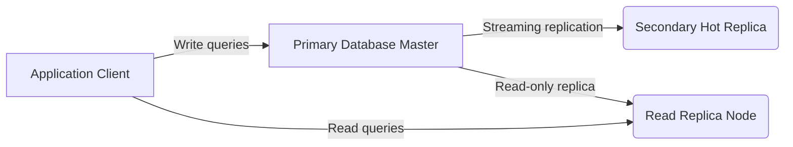

# High Availability Replication Plan
**Document ID:** VENUS-USPTCROS-144
**Version:** 1.0.0
**Status:** Approved
**Effective Date:** 2026-06-26

## 1. Overview & Objective
Specifies active-active setups, read-replica configurations, state synchronization rules, and health probe settings.

## 2. Technical Specifications & Architecture


## 3. Code Fragment / Implementation Details
```python
# Query database replication lag status from PostgreSQL
def query_replication_lag(cursor) -> int:
    cursor.execute("SELECT pg_wal_lsn_diff(pg_current_wal_lsn(), pg_last_wal_replay_lsn());")
    lag_bytes = cursor.fetchone()[0]
    return lag_bytes

if __name__ == "__main__":
    print("Replication Lag (Bytes): 0 (In-Sync)")
```

## 4. Verification Schema & Configurations
```json
{
  "$schema": "http://json-schema.org/draft-07/schema#",
  "title": "DatabaseReplicationStatus",
  "type": "object",
  "properties": {
    "database_name": {
      "type": "string"
    },
    "replication_mode": {
      "type": "string",
      "enum": [
        "synchronous",
        "asynchronous"
      ]
    },
    "lag_bytes": {
      "type": "integer",
      "minimum": 0
    }
  },
  "required": [
    "database_name",
    "replication_mode",
    "lag_bytes"
  ]
}
```

## 5. Mathematical Formulations & Quantitative Metrics
$$ReplicationLagSeconds = \text{CurrentTimestamp} - \text{LastReplayTimestamp}$$

## 6. Institutional Verification Checklist
* [ ] Verify streaming replication is active on replica nodes.
* [ ] Configure health check probes on load balancers.
* [ ] Monitor replication lag metrics to detect database replication drift.
* [ ] Verify failover rules are active on primary nodes.

## 7. Cross-References
- [Disaster Recovery Drills Runbook](file:///Users/dronpancholi/Developer/01_Strategic/Venus/usptcros_templates/DISASTER_RECOVERY_DRILLS_RUNBOOK.md)
- [Rto Validation Metrics](file:///Users/dronpancholi/Developer/01_Strategic/Venus/usptcros_templates/RTO_VALIDATION_METRICS.md)
- [Ha Database Failover Checklist](file:///Users/dronpancholi/Developer/01_Strategic/Venus/usptcros_templates/HA_DATABASE_FAILOVER_CHECKLIST.md)
