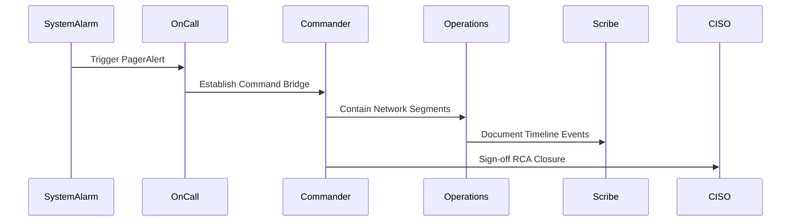

# Incident Response Plan (IRP)
**Document ID:** VENUS-USPTCROS-121
**Version:** 1.0.0
**Status:** Approved
**Effective Date:** 2026-06-26

## 1. Overview & Objective
Defines incident management procedures, key personnel roles, coordination trees, and operational response workflows.

## 2. Technical Specifications & Architecture


## 3. Code Fragment / Implementation Details
```yaml
incident_response:
  command_bridge: "https://bridge.venus.io/incident"
  comms_channel: "#incident-response"
  escalation_contacts:
    ciso: "ciso-oncall@venus.io"
    technical_lead: "tech-lead-oncall@venus.io"
```

## 4. Verification Schema & Configurations
```json
{
  "$schema": "http://json-schema.org/draft-07/schema#",
  "title": "IncidentRecordSpec",
  "type": "object",
  "properties": {
    "incident_id": {
      "type": "string",
      "pattern": "^INC-[0-9]{5}$"
    },
    "severity": {
      "type": "string",
      "enum": [
        "P1",
        "P2",
        "P3",
        "P4"
      ]
    },
    "bridge_url": {
      "type": "string",
      "format": "uri"
    }
  },
  "required": [
    "incident_id",
    "severity",
    "bridge_url"
  ]
}
```

## 5. Mathematical Formulations & Quantitative Metrics
$$MTTD = \frac{\sum (T_{detection} - T_{origin})}{Total\_Incidents}$$
$$MTTR = \frac{\sum (T_{resolution} - T_{containment})}{Total\_Incidents}$$

## 6. Institutional Verification Checklist
* [ ] Establish incident command bridges when P1 severity triggers occur.
* [ ] Designate an Incident Commander to lead coordination efforts.
* [ ] Use pre-approved communication templates for internal updates.
* [ ] Record incident activities in chronological scribe logs.

## 7. Cross-References
- [Severity Level Triage Runbook](file:///Users/dronpancholi/Developer/01_Strategic/Venus/usptcros_templates/SEVERITY_LEVEL_TRIAGE_RUNBOOK.md)
- [Post Incident Root Cause Analysis](file:///Users/dronpancholi/Developer/01_Strategic/Venus/usptcros_templates/POST_INCIDENT_ROOT_CAUSE_ANALYSIS.md)
- [Incident Timeline Scribe Log](file:///Users/dronpancholi/Developer/01_Strategic/Venus/usptcros_templates/INCIDENT_TIMELINE_SCRIBE_LOG.md)
