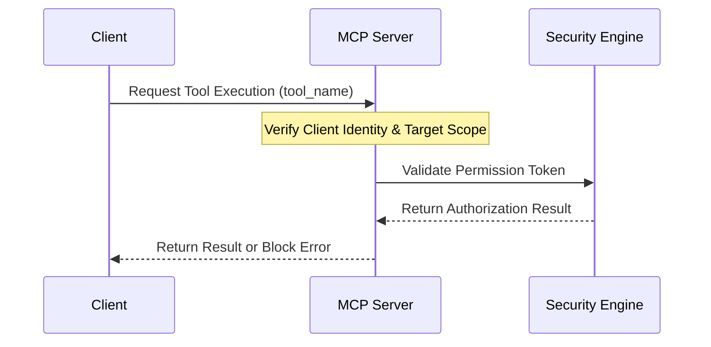

# Model Context Protocol (MCP) Server Permission Schema
**Document ID:** VENUS-USPTCROS-101
**Version:** 1.0.0
**Status:** Approved
**Effective Date:** 2026-06-26

## 1. Overview & Objective
Establishes permission control structures, scope specifications, and client authorization rules for Model Context Protocol interactions.

## 2. Technical Specifications & Architecture


## 3. Code Fragment / Implementation Details
```json
{
  "mcp_security_policy": {
    "server_identity": "mcp-core-services",
    "authorized_scopes": [
      {
        "tool": "file_reader",
        "allowed_paths": ["/Users/dronpancholi/Developer/01_Strategic/Venus/*"],
        "max_file_size_bytes": 1048576
      },
      {
        "tool": "command_runner",
        "allowed_binaries": ["/usr/bin/git", "/usr/bin/python3"],
        "block_patterns": ["rm -rf", "kill", "sh", "bash"]
      }
    ]
  }
}
```

## 4. Verification Schema & Configurations
```json
{
  "$schema": "http://json-schema.org/draft-07/schema#",
  "title": "MCPSecuritySchema",
  "type": "object",
  "properties": {
    "server_identity": {
      "type": "string"
    },
    "authorized_scopes": {
      "type": "array",
      "items": {
        "type": "object",
        "properties": {
          "tool": {
            "type": "string"
          },
          "allowed_paths": {
            "type": "array",
            "items": {
              "type": "string"
            }
          },
          "allowed_binaries": {
            "type": "array",
            "items": {
              "type": "string"
            }
          },
          "block_patterns": {
            "type": "array",
            "items": {
              "type": "string"
            }
          }
        },
        "required": [
          "tool"
        ]
      }
    }
  },
  "required": [
    "server_identity",
    "authorized_scopes"
  ]
}
```

## 5. Mathematical Formulations & Quantitative Metrics
$$AuthorizedRequestRatio = \frac{GrantedToolInvocations}{TotalRequests}$$

## 6. Institutional Verification Checklist
* [ ] Configure least-privilege permission sets for all registered MCP servers.
* [ ] Verify mutual TLS identity verification is active on connection interfaces.
* [ ] Sanitize arguments before passing them to internal shell execution environments.
* [ ] Audit tool execution history logs regularly.

## 7. Cross-References
- [Agent Tool Isolation Policy](file:///Users/dronpancholi/Developer/01_Strategic/Venus/usptcros_templates/AGENT_TOOL_ISOLATION_POLICY.md)
- [Multi Agent Consensus Verification](file:///Users/dronpancholi/Developer/01_Strategic/Venus/usptcros_templates/MULTI_AGENT_CONSENSUS_VERIFICATION.md)
- [Ai Agent Execution Audit Log](file:///Users/dronpancholi/Developer/01_Strategic/Venus/usptcros_templates/AI_AGENT_EXECUTION_AUDIT_LOG.md)
