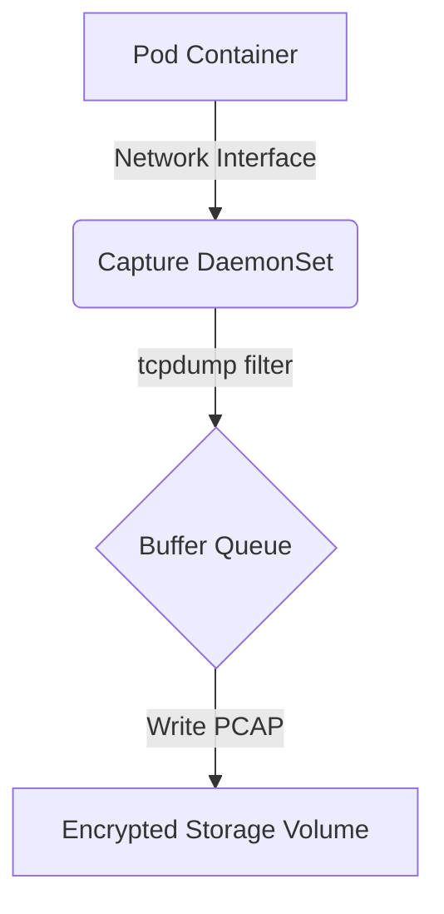

# Network Traffic Capture Specification
**Document ID:** VENUS-USPTCROS-132
**Version:** 1.0.0
**Status:** Approved
**Effective Date:** 2026-06-26

## 1. Overview & Objective
Establishes container orchestration configurations and procedures to capture network packets (PCAP) along container boundaries for forensics analysis.

## 2. Technical Specifications & Architecture


## 3. Code Fragment / Implementation Details
```yaml
apiVersion: apps/v1
kind: DaemonSet
metadata:
  name: network-traffic-capturer
  namespace: security-forensics
spec:
  selector:
    matchLabels:
      name: network-capturer
  template:
    metadata:
      labels:
        name: network-capturer
    spec:
      containers:
        - name: tcpdump-container
          image: coroot/tcpdump:latest
          securityContext:
            capabilities:
              add: ["NET_ADMIN"]
          command: ["tcpdump", "-i", "any", "-w", "/data/capture-%Y-%m-%d_%H.pcap", "-G", "3600"]
          volumeMounts:
            - name: pcap-storage
              mountPath: /data
      volumes:
        - name: pcap-storage
          emptyDir: {}
```

## 4. Verification Schema & Configurations
```json
{
  "$schema": "http://json-schema.org/draft-07/schema#",
  "title": "CaptureFilterConfiguration",
  "type": "object",
  "properties": {
    "target_namespace": {
      "type": "string"
    },
    "port_filter": {
      "type": "integer",
      "minimum": 1,
      "maximum": 65535
    },
    "capture_duration_seconds": {
      "type": "integer"
    }
  },
  "required": [
    "target_namespace",
    "port_filter",
    "capture_duration_seconds"
  ]
}
```

## 5. Mathematical Formulations & Quantitative Metrics
$$CaptureLossRate = \frac{DroppedPackets}{TotalCapturedPackets} \times 100\%$$

## 6. Institutional Verification Checklist
* [ ] Configure traffic capture DaemonSets with network administration capabilities.
* [ ] Verify capture output is directed to encrypted storage volumes.
* [ ] Limit traffic capture operations to targeted container namespaces.
* [ ] Monitor packet capture loss metrics during triage runs.

## 7. Cross-References
- [Host Incident Investigation Guide](file:///Users/dronpancholi/Developer/01_Strategic/Venus/usptcros_templates/HOST_INCIDENT_INVESTIGATION_GUIDE.md)
- [Leach Breach Notification Template](file:///Users/dronpancholi/Developer/01_Strategic/Venus/usptcros_templates/LEACH_BREACH_NOTIFICATION_TEMPLATE.md)
- [Digital Forensics Collection Runbook](file:///Users/dronpancholi/Developer/01_Strategic/Venus/usptcros_templates/DIGITAL_FORENSICS_COLLECTION_RUNBOOK.md)
