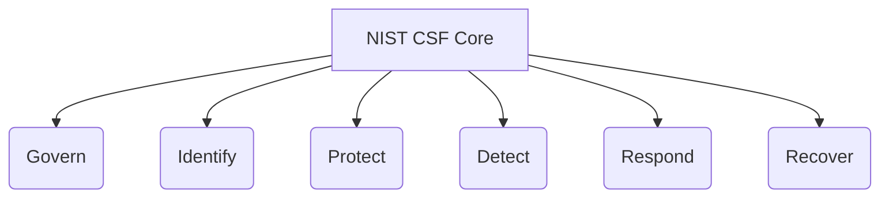

# NIST Cybersecurity Framework Mapping Matrix
**Document ID:** VENUS-USPTCROS-111
**Version:** 1.0.0
**Status:** Approved
**Effective Date:** 2026-06-26

## 1. Overview & Objective
Aligns systems and security processes with the NIST Cybersecurity Framework (CSF) v2.0 core functions: Govern, Identify, Protect, Detect, Respond, and Recover.

## 2. Technical Specifications & Architecture


## 3. Code Fragment / Implementation Details
```yaml
nist_csf_mapping:
  framework_version: "2.0"
  mappings:
    - category: "PR.DS"
      sub_category: "PR.DS-01"
      description: "Data-at-rest is protected"
      control: "Enforce AES-256 database storage volumes"
```

## 4. Verification Schema & Configurations
```json
{
  "$schema": "http://json-schema.org/draft-07/schema#",
  "title": "NISTMappingSchema",
  "type": "object",
  "properties": {
    "framework_version": {
      "type": "string"
    },
    "mappings": {
      "type": "array",
      "items": {
        "type": "object",
        "properties": {
          "category": {
            "type": "string"
          },
          "control": {
            "type": "string"
          }
        },
        "required": [
          "category",
          "control"
        ]
      }
    }
  },
  "required": [
    "framework_version",
    "mappings"
  ]
}
```

## 5. Mathematical Formulations & Quantitative Metrics
$$CSF\_Maturity\_Level = \frac{\sum_{i=1}^{n} Subcategory\_Score_i}{n}$$

## 6. Institutional Verification Checklist
* [ ] Define organizational security policies.
* [ ] Conduct regular threat modeling reviews on all architectures.
* [ ] Configure real-time monitoring and alerting pipelines.
* [ ] Verify backup restoration capabilities periodically.

## 7. Cross-References
- [Iso27001 Isms Controls Checklist](file:///Users/dronpancholi/Developer/01_Strategic/Venus/usptcros_templates/ISO27001_ISMS_CONTROLS_CHECKLIST.md)
- [Hipaa Hitech Security Controls](file:///Users/dronpancholi/Developer/01_Strategic/Venus/usptcros_templates/HIPAA_HITECH_SECURITY_CONTROLS.md)
- [Incident Response Plan](file:///Users/dronpancholi/Developer/01_Strategic/Venus/usptcros_templates/INCIDENT_RESPONSE_PLAN.md)
