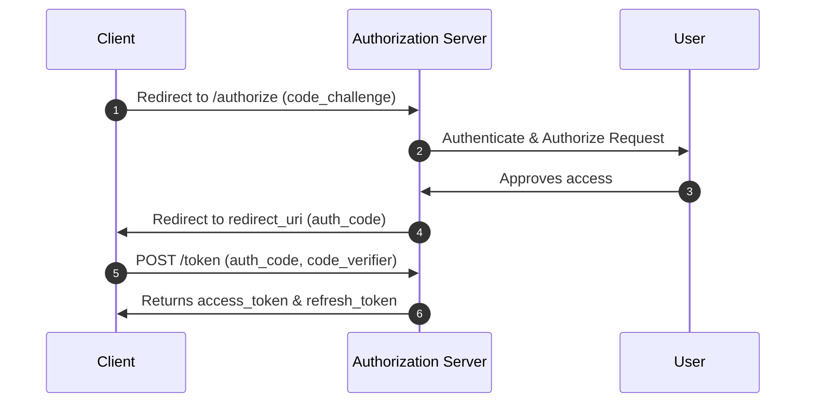

# USPTCROS OAuth 2.1 Design Specification
**Document Link:** [OAuth Design Spec](file:///Users/dronpancholi/Developer/01_Strategic/Venus/usptcros_templates/OAUTH_DESIGN_SPECIFICATION.md)  
**References:** [OIDC Integration Blueprint](file:///Users/dronpancholi/Developer/01_Strategic/Venus/usptcros_templates/OIDC_INTEGRATION_BLUEPRINT.md)

## 1. Flow Diagram: Auth Code Grant with PKCE
The standard flow for all interactive clients is Auth Code Grant + PKCE. Implicit grant is disabled.



## 2. Parameter Definitions
* **code_challenge_method:** Must be `S256` only.
* **Access Token Format:** RFC 7519 JWT format. Validated locally via JWKS.
* **Token Lifetime:** Access Token (15 mins), Refresh Token (12 hours).

## 3. Client Registration Configuration Example
```json
{
  "client_id": "venus-core-portal",
  "client_name": "Project Venus Management Portal",
  "grant_types": ["authorization_code", "refresh_token"],
  "token_endpoint_auth_method": "private_key_jwt",
  "redirect_uris": ["https://portal.venus.local/oauth/callback"],
  "scopes": ["openid", "profile", "venus:core:read", "venus:core:write"]
}
```
