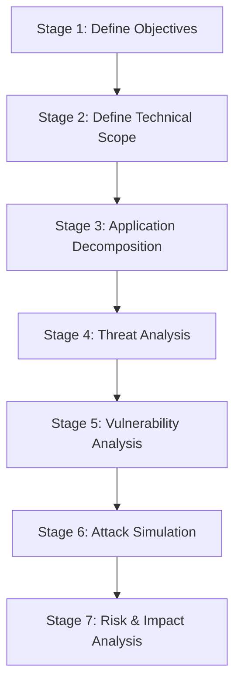

# USPTCROS PASTA Risk Assessment
**Document Link:** [PASTA Risk Assessment](file:///Users/dronpancholi/Developer/01_Strategic/Venus/usptcros_templates/PASTA_RISK_ASSESSMENT.md)

This manual defines the application of the Process for Attack Simulation and Threat Analysis (PASTA) framework to Project Venus.

## 1. The Seven Stages of PASTA

### Stage 1: Define Objectives
Establish business objectives, compliance requirements (NIST 800-53, ISO 27001), and the acceptable risk threshold.

### Stage 2: Define Technical Scope
Identify all infrastructure assets, platform services (Kubernetes, IAM, VMs), and communication interfaces. Refer to [Security Architecture Blueprint](file:///Users/dronpancholi/Developer/01_Strategic/Venus/usptcros_templates/SECURITY_ARCHITECTURE_BLUEPRINT.md).

### Stage 3: Application Decomposition
Decompose system logic into actors, entry points, interfaces, and data assets. Maps directly to the [Trust Boundary Map](file:///Users/dronpancholi/Developer/01_Strategic/Venus/usptcros_templates/TRUST_BOUNDARY_MAP.md).

### Stage 4: Threat Analysis
Analyze external threat intelligence, common attack vectors, and exploit patterns.

### Stage 5: Vulnerability & Weakness Analysis
Audit code repositories, system configurations, and dependencies. See [OWASP ASVS Verification Report](file:///Users/dronpancholi/Developer/01_Strategic/Venus/usptcros_templates/OWASP_ASVS_VERIFICATION_REPORT.md).

### Stage 6: Attack Simulation
Create attack trees and map attack vectors to system vulnerabilities. Refer to [Attack Tree Diagram](file:///Users/dronpancholi/Developer/01_Strategic/Venus/usptcros_templates/ATTACK_TREE_DIAGRAM.md).

### Stage 7: Risk & Impact Analysis
Calculate residual risks and define remediation controls.

## 2. Business Impact and Risk Formula
The risk of a threat event is modeled as:
$$Risk = \text{Probability of Exploitation} \times \text{Asset Value} \times \text{Impact Factor}$$

Where:
* **Probability of Exploitation (0.0 to 1.0):** Derived from CVSS exploitability metrics.
* **Asset Value (1 to 10):** Level assigned in [Data Classification Matrix](file:///Users/dronpancholi/Developer/01_Strategic/Venus/usptcros_templates/DATA_CLASSIFICATION_MATRIX.md).
* **Impact Factor (1 to 10):** Extent of damage (Confidentiality, Integrity, Availability loss).
