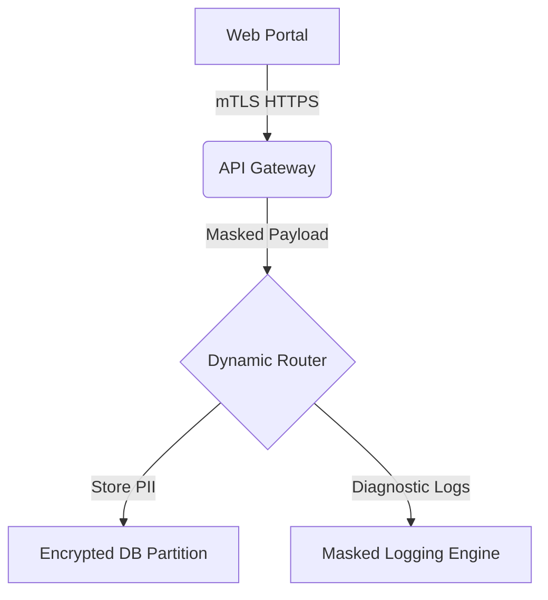

# PII Inventory and Data Flow Map
**Document ID:** VENUS-USPTCROS-117
**Version:** 1.0.0
**Status:** Approved
**Effective Date:** 2026-06-26

## 1. Overview & Objective
Establishes data flow visualization standards, catalog definitions, and mapping formats for tracking PII processing.

## 2. Technical Specifications & Architecture


## 3. Code Fragment / Implementation Details
```yaml
pii_inventory:
  - table_name: "users"
    fields:
      - name: "email"
        classification: "HighlyConfidential"
        encryption_status: "EnvelopeEncrypted"
      - name: "first_name"
        classification: "Confidential"
        encryption_status: "Encrypted"
```

## 4. Verification Schema & Configurations
```json
{
  "$schema": "http://json-schema.org/draft-07/schema#",
  "title": "PIIElementRecord",
  "type": "object",
  "properties": {
    "field_identifier": {
      "type": "string"
    },
    "classification": {
      "type": "string",
      "enum": [
        "Public",
        "Internal",
        "Confidential",
        "HighlyConfidential"
      ]
    },
    "transit_encryption": {
      "type": "string"
    }
  },
  "required": [
    "field_identifier",
    "classification",
    "transit_encryption"
  ]
}
```

## 5. Mathematical Formulations & Quantitative Metrics
$$PII\_Density = \frac{\text{PII Fields}}{\text{Total Data Fields}}$$

## 6. Institutional Verification Checklist
* [ ] Maintain an active inventory of fields classified as PII.
* [ ] Verify all transit channels handling PII are configured with transport encryption.
* [ ] Run automated schema checks to detect unclassified PII fields.
* [ ] Audit PII databases to ensure database access rules are enforced.

## 7. Cross-References
- [Subject Access Request Plan](file:///Users/dronpancholi/Developer/01_Strategic/Venus/usptcros_templates/SUBJECT_ACCESS_REQUEST_PLAN.md)
- [Data Locality Sovereignty Blueprint](file:///Users/dronpancholi/Developer/01_Strategic/Venus/usptcros_templates/DATA_LOCALITY_SOVEREIGNTY_BLUEPRINT.md)
- [Privacy Notice Template](file:///Users/dronpancholi/Developer/01_Strategic/Venus/usptcros_templates/PRIVACY_NOTICE_TEMPLATE.md)
