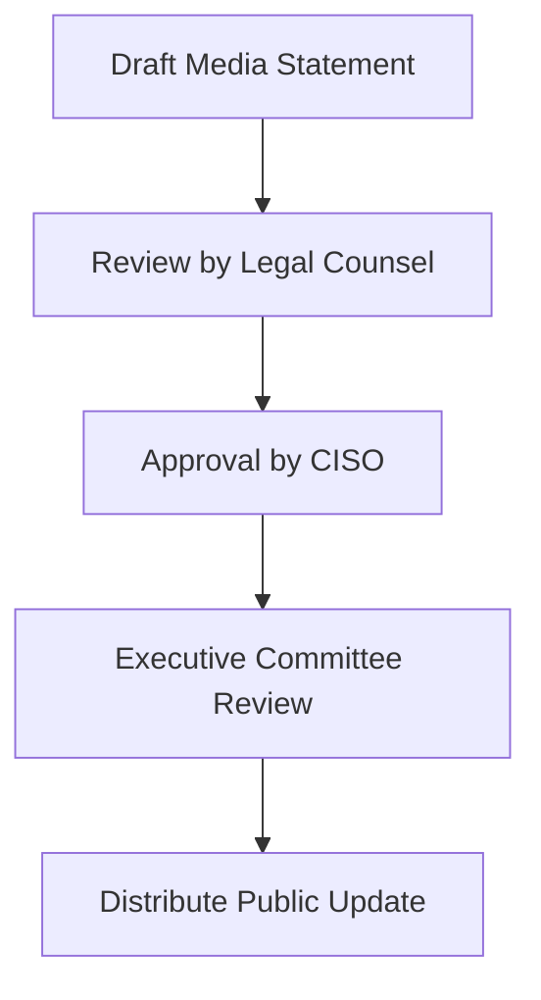

# Public Relations Communication Kit
**Document ID:** VENUS-USPTCROS-134
**Version:** 1.0.0
**Status:** Approved
**Effective Date:** 2026-06-26

## 1. Overview & Objective
Provides communications checklists, media Q&A templates, and approval workflows during security incidents.

## 2. Technical Specifications & Architecture


## 3. Code Fragment / Implementation Details
```yaml
pr_crisis_config:
  spokesperson: "vp-communications@venus.io"
  media_inquiries_email: "media-relations@venus.io"
  authorized_channels:
    - official_blog
    - press_release
```

## 4. Verification Schema & Configurations
```json
{
  "$schema": "http://json-schema.org/draft-07/schema#",
  "title": "PRApprovalFlow",
  "type": "object",
  "properties": {
    "incident_ref": {
      "type": "string"
    },
    "legal_sign_off": {
      "type": "boolean",
      "enum": [
        true
      ]
    },
    "ciso_sign_off": {
      "type": "boolean",
      "enum": [
        true
      ]
    }
  },
  "required": [
    "incident_ref",
    "legal_sign_off",
    "ciso_sign_off"
  ]
}
```

## 5. Mathematical Formulations & Quantitative Metrics
$$MediaResponseDelay = T_{statement} - T_{incident\_contained}$$

## 6. Institutional Verification Checklist
* [ ] Designate a spokesperson for all public updates.
* [ ] Verify statement details with legal counsel before release.
* [ ] Provide regular status updates to internal team members.
* [ ] Publish public statements only through authorized communication channels.

## 7. Cross-References
- [Leach Breach Notification Template](file:///Users/dronpancholi/Developer/01_Strategic/Venus/usptcros_templates/LEACH_BREACH_NOTIFICATION_TEMPLATE.md)
- [Post Incident Action Tracker](file:///Users/dronpancholi/Developer/01_Strategic/Venus/usptcros_templates/POST_INCIDENT_ACTION_TRACKER.md)
- [Crisis Management Command Structure](file:///Users/dronpancholi/Developer/01_Strategic/Venus/usptcros_templates/CRISIS_MANAGEMENT_COMMAND_STRUCTURE.md)
