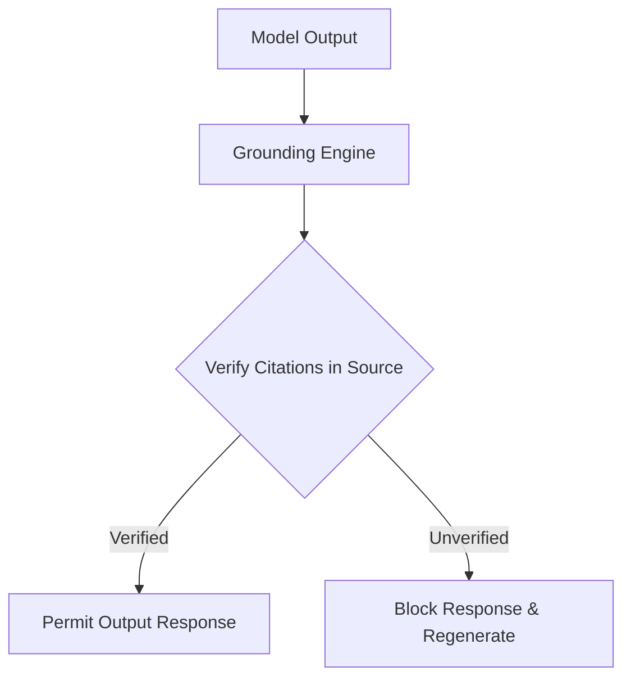

# RAG Source Grounding and Verification Specification
**Document ID:** VENUS-USPTCROS-104
**Version:** 1.0.0
**Status:** Approved
**Effective Date:** 2026-06-26

## 1. Overview & Objective
Establishes protocols to check, verify, and ground outputs from Retrieval-Augmented Generation (RAG) processes against source systems to prevent hallucinations.

## 2. Technical Specifications & Architecture


## 3. Code Fragment / Implementation Details
```python
# RAG Source Grounding Check
def verify_response_grounding(response_claims: list, source_documents: list) -> dict:
    verified_claims = []
    unverified_claims = []
    
    for claim in response_claims:
        # Check if the claim contains keywords found in source documents
        if any(word in doc.lower() for doc in source_documents for word in claim.lower().split()):
            verified_claims.append(claim)
        else:
            unverified_claims.append(claim)
            
    coverage = len(verified_claims) / len(response_claims) if response_claims else 0.0
    return {"verified": coverage >= 0.9, "coverage_ratio": coverage}

if __name__ == "__main__":
    claims = ["Database password is encrypted", "Access requires token rotation"]
    sources = ["all databases use encryption", "tokens are rotated periodically"]
    print(verify_response_grounding(claims, sources))
```

## 4. Verification Schema & Configurations
```json
{
  "$schema": "http://json-schema.org/draft-07/schema#",
  "title": "GroundingMetadata",
  "type": "object",
  "properties": {
    "session_id": {
      "type": "string"
    },
    "citations": {
      "type": "array",
      "items": {
        "type": "object",
        "properties": {
          "source_doc_id": {
            "type": "string"
          },
          "character_range": {
            "type": "string"
          }
        },
        "required": [
          "source_doc_id"
        ]
      }
    }
  },
  "required": [
    "session_id",
    "citations"
  ]
}
```

## 5. Mathematical Formulations & Quantitative Metrics
$$GroundingCoverage = \frac{GroundedClaims}{TotalClaims} \times 100\%$$

## 6. Institutional Verification Checklist
* [ ] Verify all response claims match citation keys in original sources.
* [ ] Block outputs if the grounding coverage score falls below 90.0%.
* [ ] Sanitize citation metadata prior to retrieval operations.
* [ ] Verify document indices match source data systems.

## 7. Cross-References
- [Rag Poisoning Detection Spec](file:///Users/dronpancholi/Developer/01_Strategic/Venus/usptcros_templates/RAG_POISONING_DETECTION_SPEC.md)
- [Ai Agent Execution Audit Log](file:///Users/dronpancholi/Developer/01_Strategic/Venus/usptcros_templates/AI_AGENT_EXECUTION_AUDIT_LOG.md)
- [Model Watermarking Policy](file:///Users/dronpancholi/Developer/01_Strategic/Venus/usptcros_templates/MODEL_WATERMARKING_POLICY.md)
