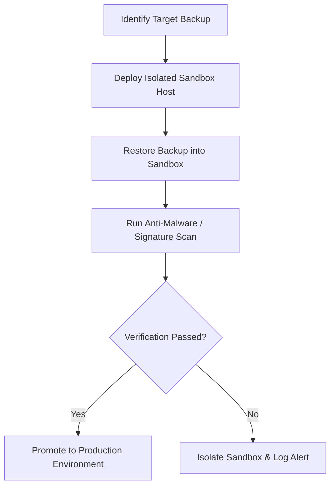

# Ransomware Recovery Backup Plan
**Document ID:** VENUS-USPTCROS-140
**Version:** 1.0.0
**Status:** Approved
**Effective Date:** 2026-06-26

## 1. Overview & Objective
Establishes validation, sanitization, and restoration procedures to restore data from backups during ransomware events, preventing recovery loops.

## 2. Technical Specifications & Architecture


## 3. Code Fragment / Implementation Details
```bash
#!/usr/bin/env bash
# Verify signature and scan backup archive for malware indicators
set -euo pipefail

BACKUP_ARCHIVE="/mnt/backups/venus_db_latest.tar.gz"
EXPECTED_SIGNER="backup-service@venus.io"

echo "Verifying backup cryptographic signature..."
cosign verify-blob \
  --certificate-identity "${EXPECTED_SIGNER}" \
  --certificate-oidc-issuer "https://token.actions.githubusercontent.com" \
  --signature "${BACKUP_ARCHIVE}.sig" \
  "${BACKUP_ARCHIVE}"
```

## 4. Verification Schema & Configurations
```json
{
  "$schema": "http://json-schema.org/draft-07/schema#",
  "title": "BackupCleanlinessCheck",
  "type": "object",
  "properties": {
    "backup_archive": {
      "type": "string"
    },
    "cleanliness_confirmed": {
      "type": "boolean",
      "enum": [
        true
      ]
    },
    "scanned_for_extensions": {
      "type": "boolean"
    }
  },
  "required": [
    "backup_archive",
    "cleanliness_confirmed",
    "scanned_for_extensions"
  ]
}
```

## 5. Mathematical Formulations & Quantitative Metrics
$$CleanBackupRate = \frac{VerifiedCleanBackups}{TotalBackupsReviewed} \times 100\%$$

## 6. Institutional Verification Checklist
* [ ] Scan backup archives for known ransomware extensions before restoration.
* [ ] Perform backup restoration runs within isolated environments.
* [ ] Verify signatures on database backup images.
* [ ] Lock down target restoration environment network pathways.

## 7. Cross-References
- [Cyber Resilience Steady State](file:///Users/dronpancholi/Developer/01_Strategic/Venus/usptcros_templates/CYBER_RESILIENCE_STEADY_STATE.md)
- [Offsite Backup Replication Standard](file:///Users/dronpancholi/Developer/01_Strategic/Venus/usptcros_templates/OFFSITE_BACKUP_REPLICATION_STANDARD.md)
- [Ransomware Response Action Plan](file:///Users/dronpancholi/Developer/01_Strategic/Venus/usptcros_templates/RANSOMWARE_RESPONSE_ACTION_PLAN.md)
