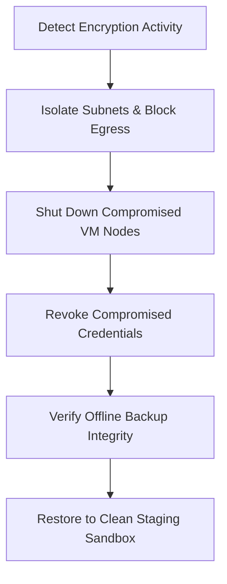

# Ransomware Response Action Plan
**Document ID:** VENUS-USPTCROS-129
**Version:** 1.0.0
**Status:** Approved
**Effective Date:** 2026-06-26

## 1. Overview & Objective
Defines immediate containment, systems isolation, credential revocation, and clean-state backup restoration procedures during ransomware attacks.

## 2. Technical Specifications & Architecture


## 3. Code Fragment / Implementation Details
```python
# Mock cloud containment script isolating a subnet
def quarantine_network_subnet(subnet_id: str, cloud_client) -> dict:
    # Modify security group rules to deny inbound and outbound traffic
    response = cloud_client.update_security_group_rules(
        subnet_id=subnet_id,
        rules=[
            {"protocol": "all", "cidr": "0.0.0.0/0", "action": "DENY"}
        ]
    )
    return {"status": "ISOLATED", "response": response}

if __name__ == "__main__":
    print("Action Result: Simulated isolation triggered")
```

## 4. Verification Schema & Configurations
```json
{
  "$schema": "http://json-schema.org/draft-07/schema#",
  "title": "RansomwareIncidentState",
  "type": "object",
  "properties": {
    "compromised_node_ids": {
      "type": "array",
      "items": {
        "type": "string"
      }
    },
    "containment_achieved": {
      "type": "boolean"
    },
    "backup_signature_verified": {
      "type": "boolean"
    }
  },
  "required": [
    "compromised_node_ids",
    "containment_achieved",
    "backup_signature_verified"
  ]
}
```

## 5. Mathematical Formulations & Quantitative Metrics
$$ContainmentTime = T_{isolation} - T_{alert\_trigger}$$

## 6. Institutional Verification Checklist
* [ ] Block network traffic in subnets showing active indicators of compromise.
* [ ] Power down infected virtual machines and host nodes.
* [ ] Revoke security credentials for affected system accounts.
* [ ] Verify signatures on offline backup images before starting restoration.

## 7. Cross-References
- [Log Retention Tamper Proofing](file:///Users/dronpancholi/Developer/01_Strategic/Venus/usptcros_templates/LOG_RETENTION_TAMPER_PROOFING.md)
- [Compromised Credentials Revocation](file:///Users/dronpancholi/Developer/01_Strategic/Venus/usptcros_templates/COMPROMISED_CREDENTIALS_REVOCATION.md)
- [Ransomware Recovery Backup Plan](file:///Users/dronpancholi/Developer/01_Strategic/Venus/usptcros_templates/RANSOMWARE_RECOVERY_BACKUP_PLAN.md)
