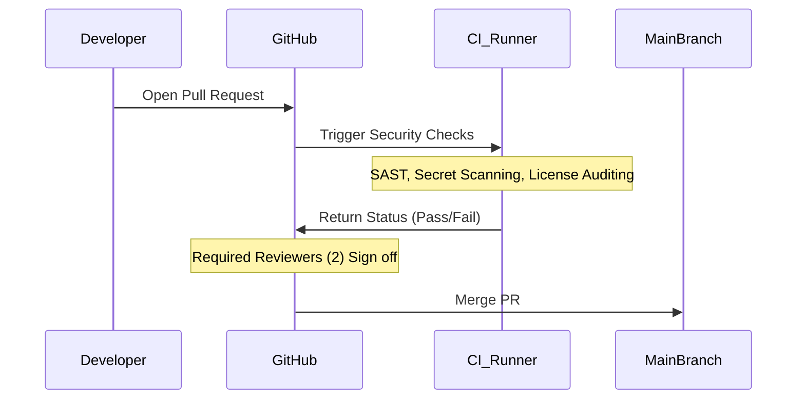

# Secure PR Verification Plan
**Document ID:** VENUS-USPTCROS-080
**Version:** 1.0.0
**Status:** Approved
**Effective Date:** 2026-06-26

## 1. Overview & Objective
Sets forth the automated evaluation rules, security gates, and mandatory reviews required before any code can be merged into branch lines.

## 2. Technical Specifications & Architecture


## 3. Code Fragment / Implementation Details
```yaml
name: Secure PR Verification
on:
  pull_request:
    branches: [ main ]
jobs:
  pr-security-gate:
    runs-on: ubuntu-latest
    steps:
      - name: Checkout Code
        uses: actions/checkout@v3
      - name: Secret Detection Scanner
        uses: trufflesecurity/trufflehog@main
        with:
          path: ./
          base: ${{ github.event.pull_request.base.sha }}
          head: ${{ github.event.pull_request.head.sha }}
          extra_args: --debug --only-verified
```

## 4. Verification Schema & Configurations
```json
{
  "$schema": "http://json-schema.org/draft-07/schema#",
  "title": "PRVerificationPolicy",
  "type": "object",
  "properties": {
    "required_approvals": {
      "type": "integer",
      "minimum": 2
    },
    "require_signed_commits": {
      "type": "boolean"
    },
    "dismiss_stale_approvals": {
      "type": "boolean"
    },
    "allowed_merge_types": {
      "type": "array",
      "items": {
        "type": "string",
        "enum": [
          "squash",
          "rebase",
          "merge"
        ]
      }
    }
  },
  "required": [
    "required_approvals",
    "require_signed_commits",
    "dismiss_stale_approvals",
    "allowed_merge_types"
  ]
}
```

## 5. Mathematical Formulations & Quantitative Metrics
$$VerificationGateIndex = \frac{\text{PassedChecks}}{\text{ActiveSecurityChecks}} \times 100\%$$

## 6. Institutional Verification Checklist
* [ ] Confirm that at least two authorized developers have reviewed and approved the pull request.
* [ ] Verify all commits associated with the PR are cryptographically signed using GPG or SSH keys.
* [ ] Run automated secret detection scanning (TruffleHog) to ensure no plaintext credentials exist.
* [ ] Confirm that all unit tests, integration tests, and static analysis gates have returned pass states.

## 7. Cross-References
- [Cicd Pipeline Hardening Spec](file:///Users/dronpancholi/Developer/01_Strategic/Venus/usptcros_templates/CICD_PIPELINE_HARDENING_SPEC.md)
- [Static Analysis Quality Gate](file:///Users/dronpancholi/Developer/01_Strategic/Venus/usptcros_templates/STATIC_ANALYSIS_QUALITY_GATE.md)
- [Dependency Pinning Lockfile](file:///Users/dronpancholi/Developer/01_Strategic/Venus/usptcros_templates/DEPENDENCY_PINNING_LOCKFILE.md)
