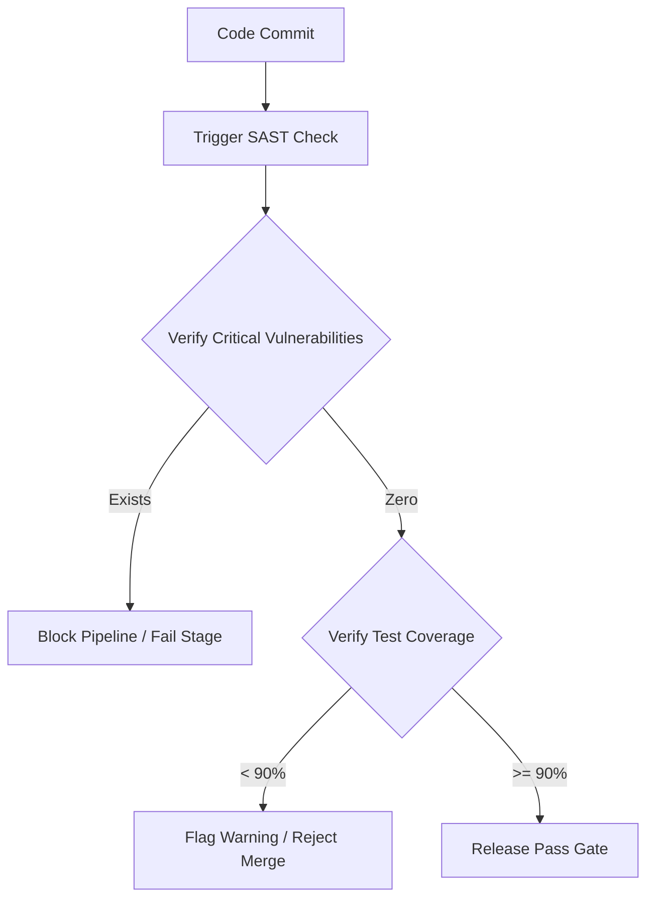

# Static Analysis Quality Gate Specification
**Document ID:** VENUS-USPTCROS-087
**Version:** 1.0.0
**Status:** Approved
**Effective Date:** 2026-06-26

## 1. Overview & Objective
Defines strict gates, thresholds, and scan compliance criteria for SAST (Static Application Security Testing) tools that must be satisfied before any production deployment.

## 2. Technical Specifications & Architecture


## 3. Code Fragment / Implementation Details
```json
{
  "quality_gate": {
    "name": "Venus-Production-Gate",
    "conditions": [
      {
        "metric": "security_rating",
        "op": "GT",
        "error": "A"
      },
      {
        "metric": "vulnerabilities",
        "op": "GT",
        "error": "0"
      },
      {
        "metric": "coverage",
        "op": "LT",
        "error": "90.0"
      }
    ]
  }
}
```

## 4. Verification Schema & Configurations
```json
{
  "$schema": "http://json-schema.org/draft-07/schema#",
  "title": "SASTThresholds",
  "type": "object",
  "properties": {
    "block_on_critical": {
      "type": "boolean",
      "enum": [
        true
      ]
    },
    "minimum_coverage": {
      "type": "number",
      "minimum": 80.0
    },
    "max_allowed_high_vulns": {
      "type": "integer",
      "maximum": 0
    }
  },
  "required": [
    "block_on_critical",
    "minimum_coverage",
    "max_allowed_high_vulns"
  ]
}
```

## 5. Mathematical Formulations & Quantitative Metrics
$$SecurityDebtIndex = \frac{\text{OpenIssues}}{\text{TotalLinesOfCode}} \times 1000$$

## 6. Institutional Verification Checklist
* [ ] Scan codebase using static analyzers (Semgrep/SonarQube) during pull request builds.
* [ ] Verify there are zero unresolved Critical or High security vulnerability alerts.
* [ ] Maintain overall test coverage above the 90.0% threshold.
* [ ] Verify that any security exemptions are documented and approved by the CISO.

## 7. Cross-References
- [Secure Pr Verification Plan](file:///Users/dronpancholi/Developer/01_Strategic/Venus/usptcros_templates/SECURE_PR_VERIFICATION_PLAN.md)
- [Vulnerability Disclosure Vex Schema](file:///Users/dronpancholi/Developer/01_Strategic/Venus/usptcros_templates/VULNERABILITY_DISCLOSURE_VEX_SCHEMA.md)
- [Cicd Pipeline Hardening Spec](file:///Users/dronpancholi/Developer/01_Strategic/Venus/usptcros_templates/CICD_PIPELINE_HARDENING_SPEC.md)
