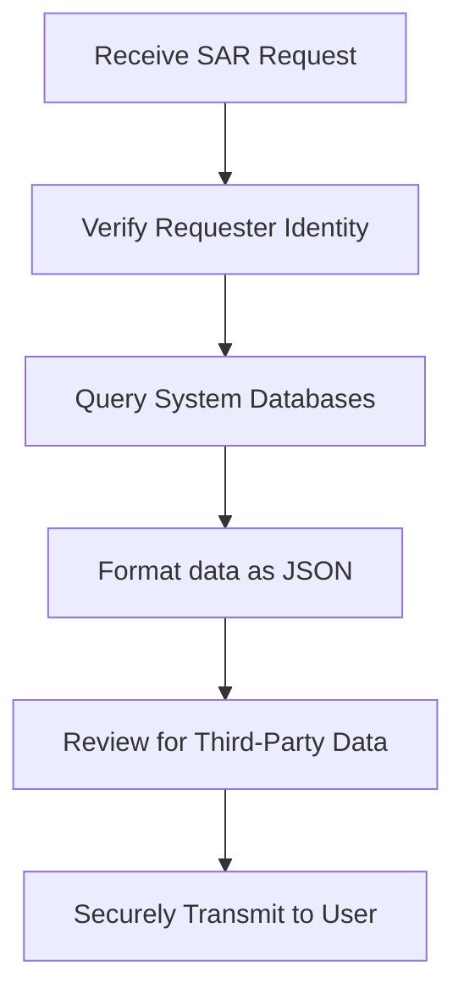

# Subject Access Request (SAR) Processing Plan
**Document ID:** VENUS-USPTCROS-115
**Version:** 1.0.0
**Status:** Approved
**Effective Date:** 2026-06-26

## 1. Overview & Objective
Establishes compliance procedures to identify, retrieve, format, and securely transmit user PII data requested via Subject Access Requests.

## 2. Technical Specifications & Architecture


## 3. Code Fragment / Implementation Details
```python
# Mock user data extraction script
import json

def extract_user_pii(user_uuid: str, db_connection) -> str:
    # Query database tables for user data
    cursor = db_connection.cursor()
    cursor.execute("SELECT email, first_name, address FROM users WHERE id = %s", (user_uuid,))
    user_record = cursor.fetchone()
    
    if not user_record:
        raise ValueError("User identifier not found")
        
    pii_payload = {
        "user_id": user_uuid,
        "email": user_record[0],
        "first_name": user_record[1],
        "address": user_record[2]
    }
    return json.dumps(pii_payload)
```

## 4. Verification Schema & Configurations
```json
{
  "$schema": "http://json-schema.org/draft-07/schema#",
  "title": "SARRequestRecord",
  "type": "object",
  "properties": {
    "request_id": {
      "type": "string"
    },
    "identity_verified": {
      "type": "boolean",
      "enum": [
        true
      ]
    },
    "date_received": {
      "type": "string",
      "format": "date"
    },
    "status": {
      "type": "string",
      "enum": [
        "open",
        "processing",
        "completed"
      ]
    }
  },
  "required": [
    "request_id",
    "identity_verified",
    "date_received",
    "status"
  ]
}
```

## 5. Mathematical Formulations & Quantitative Metrics
$$ResolutionLatency = Timestamp_{sent} - Timestamp_{received}$$ (Must remain $\le 30$ days under GDPR)

## 6. Institutional Verification Checklist
* [ ] Verify identity proofing is complete before extracting data.
* [ ] Extract PII records across all active databases.
* [ ] Sanitize payloads to remove third-party personal details.
* [ ] Verify delivery mechanisms use encrypted transfer options.

## 7. Cross-References
- [Data Retention Deletion Schedule](file:///Users/dronpancholi/Developer/01_Strategic/Venus/usptcros_templates/DATA_RETENTION_DELETION_SCHEDULE.md)
- [Pii Inventory Data Flow Map](file:///Users/dronpancholi/Developer/01_Strategic/Venus/usptcros_templates/PII_INVENTORY_DATA_FLOW_MAP.md)
- [Data Locality Sovereignty Blueprint](file:///Users/dronpancholi/Developer/01_Strategic/Venus/usptcros_templates/DATA_LOCALITY_SOVEREIGNTY_BLUEPRINT.md)
