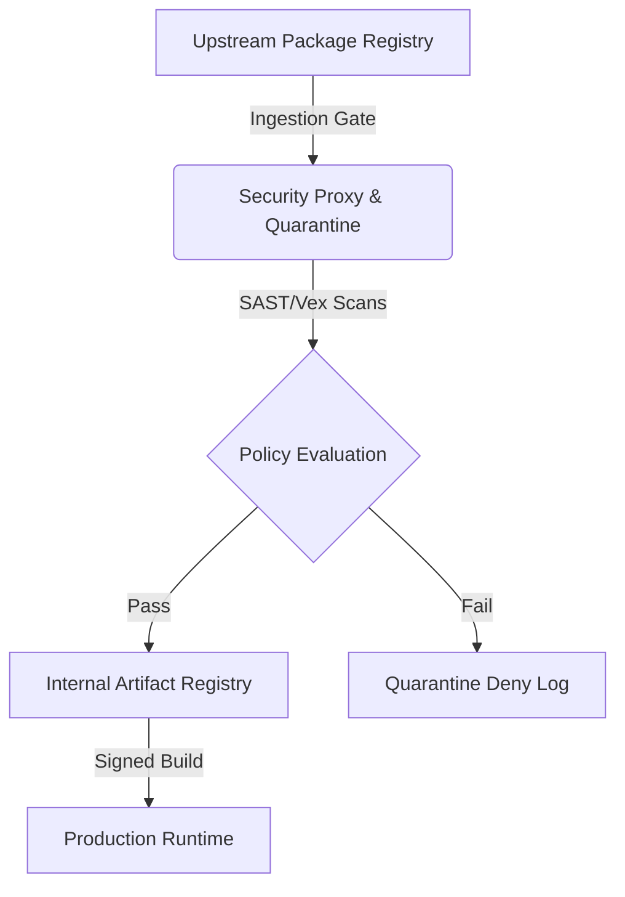

# Supply Chain Attack Analysis Framework
**Document ID:** VENUS-USPTCROS-076
**Version:** 1.0.0
**Status:** Approved
**Effective Date:** 2026-06-26

## 1. Overview & Objective
This document outlines the security framework for analyzing, assessing, and mitigating software supply chain attack vectors. It establishes standard controls to prevent, detect, and respond to threats originating from third-party vendor systems, compromised packages, open-source repositories, and dynamic ingestion vectors.

## 2. Technical Specifications & Architecture


## 3. Code Fragment / Implementation Details
```python
import hashlib
import urllib.request
import json
import sys

def verify_artifact_hash(artifact_url, expected_sha256):
    try:
        req = urllib.request.Request(artifact_url, headers={'User-Agent': 'VenusSupplyChainAuditor/1.0'})
        with urllib.request.urlopen(req) as response:
            content = response.read()
            actual_sha256 = hashlib.sha256(content).hexdigest()
            if actual_sha256 == expected_sha256:
                return {"status": "SUCCESS", "sha256": actual_sha256}
            else:
                return {"status": "FAILED", "actual": actual_sha256, "expected": expected_sha256}
    except Exception as e:
        return {"status": "ERROR", "message": str(e)}

if __name__ == "__main__":
    test_url = "https://example.com/package.tar.gz"
    test_hash = "e3b0c44298fc1c149afbf4c8996fb92427ae41e4649b934ca495991b7852b855"
    print(json.dumps(verify_artifact_hash(test_url, test_hash), indent=2))
```

## 4. Verification Schema & Configurations
```json
{
  "$schema": "http://json-schema.org/draft-07/schema#",
  "title": "SupplyChainThreatRecord",
  "type": "object",
  "properties": {
    "incident_id": {
      "type": "string",
      "pattern": "^VENUS-SC-[0-9]{5}$"
    },
    "compromised_package": {
      "type": "string"
    },
    "affected_versions": {
      "type": "array",
      "items": {
        "type": "string"
      }
    },
    "threat_vector": {
      "type": "string",
      "enum": [
        "typosquatting",
        "dependency_confusion",
        "compromised_binary",
        "malicious_pull_request"
      ]
    },
    "mitigation_status": {
      "type": "string",
      "enum": [
        "unmitigated",
        "quarantined",
        "patched",
        "revoked"
      ]
    }
  },
  "required": [
    "incident_id",
    "compromised_package",
    "affected_versions",
    "threat_vector",
    "mitigation_status"
  ],
  "additionalProperties": false
}
```

## 5. Mathematical Formulations & Quantitative Metrics
$$Risk_{supply} = (Threat_{severity} \times Vulnerability_{exposure}) \times (1 - Mitigation_{factor})$$
Where Threat Severity is a value [1-10], Vulnerability Exposure represents codebase penetration [0.0-1.0], and Mitigation Factor reflects active security runtime controls [0.0-1.0].

## 6. Institutional Verification Checklist
* [ ] Verify package integrity using cryptographic hash checks before loading into isolated environment.
* [ ] Scan open source dependencies for active typosquatting indicators (e.g. Levenshtein distance check).
* [ ] Verify that dependencies resolve through the authenticated internal private registry proxy only.
* [ ] Verify code signing signatures against authorized keys prior to registry promotion.

## 7. Cross-References
- [Dependency Risk Report](file:///Users/dronpancholi/Developer/01_Strategic/Venus/usptcros_templates/DEPENDENCY_RISK_REPORT.md)
- [Sbom Lifecycle Specification](file:///Users/dronpancholi/Developer/01_Strategic/Venus/usptcros_templates/SBOM_LIFECYCLE_SPECIFICATION.md)
- [Oss Ingestion Policy Standard](file:///Users/dronpancholi/Developer/01_Strategic/Venus/usptcros_templates/OSS_INGESTION_POLICY_STANDARD.md)
