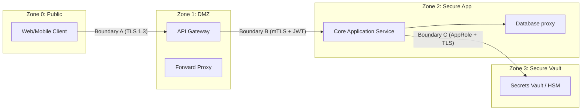

# USPTCROS Trust Boundary Map
**Document Link:** [Trust Boundary Map](file:///Users/dronpancholi/Developer/01_Strategic/Venus/usptcros_templates/TRUST_BOUNDARY_MAP.md)  
**Verification Checklist:** [Trust Boundary Checklist](file:///Users/dronpancholi/Developer/01_Strategic/Venus/usptcros_templates/TRUST_BOUNDARY_CHECKLIST.md)

## 1. Trust Zone Definitions
The environment is segregated into four primary trust zones:

```
[Zone 0: Public Internet] 
         │
  [Trust Boundary A: API Gateway Edge]
         ▼
[Zone 1: Perimeter Zone / DMZ]
         │
  [Trust Boundary B: Namespace Firewalls]
         ▼
[Zone 2: Secure Application Zone]
         │
  [Trust Boundary C: Hardened IAM / Encryption]
         ▼
[Zone 3: High-Security Cryptographic Vault]
```

## 2. Segregation Control Matrix
| Transition | Source Zone | Destination Zone | Protocols Allowed | Authentication | Authorization Policy |
|---|---|---|---|---|---|
| **Boundary A** | Zone 0 (Public) | Zone 1 (DMZ) | HTTPS (TLS 1.3 only) | Open / OAuth API Keys | Edge Gateway Routing Config |
| **Boundary B** | Zone 1 (DMZ) | Zone 2 (App) | gRPC / HTTPS | mTLS + JWT | Kubernetes Network Policies |
| **Boundary C** | Zone 2 (App) | Zone 3 (Vault) | HTTPS + TCP | mTLS + AppRole | IAM Policy + HSM Policy |

## 3. Trust Boundary Diagram

