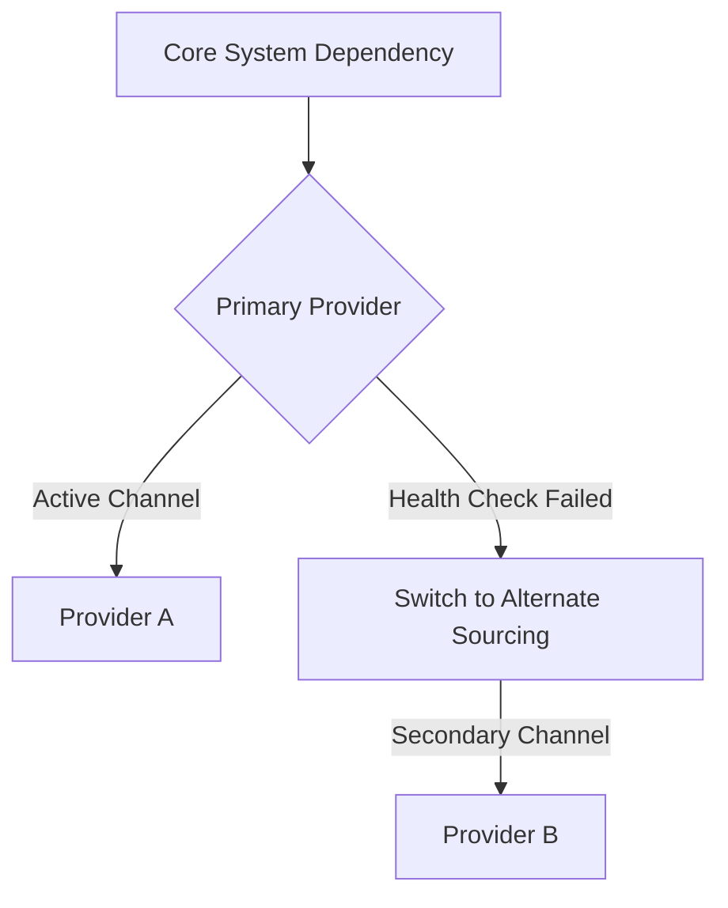

# Vendor Alternate Sourcing Matrix
**Document ID:** VENUS-USPTCROS-149
**Version:** 1.0.0
**Status:** Approved
**Effective Date:** 2026-06-26

## 1. Overview & Objective
Establishes a contingency matrix mapping third-party services and dependencies to alternate backup providers to mitigate single points of failure.

## 2. Technical Specifications & Architecture


## 3. Code Fragment / Implementation Details
```yaml
alternate_sourcing_matrix:
  critical_dependencies:
    - dependency_domain: "DNS Traffic Management"
      primary_provider: "Cloudflare DNS"
      alternate_provider: "Route53 DNS"
      failover_playbook_ref: "file:///Users/dronpancholi/Developer/01_Strategic/Venus/usptcros_templates/ALTERNATE_SITE_OPERATING_PLAN.md"
```

## 4. Verification Schema & Configurations
```json
{
  "$schema": "http://json-schema.org/draft-07/schema#",
  "title": "SourcingMatrixSchema",
  "type": "object",
  "properties": {
    "dependency_domain": {
      "type": "string"
    },
    "primary_provider": {
      "type": "string"
    },
    "alternate_provider": {
      "type": "string"
    }
  },
  "required": [
    "dependency_domain",
    "primary_provider",
    "alternate_provider"
  ]
}
```

## 5. Mathematical Formulations & Quantitative Metrics
$$SourcingResilienceScore = \frac{AlternateVendorsApproved}{TotalCriticalVendors} \times 100\%$$

## 6. Institutional Verification Checklist
* [ ] Identify single points of failure (SPOF) within critical dependencies.
* [ ] Draft backup agreement structures with secondary providers.
* [ ] Review data migration and service transition pathways.
* [ ] Test secondary configurations periodically to check integration status.

## 7. Cross-References
- [Crisis Management Command Structure](file:///Users/dronpancholi/Developer/01_Strategic/Venus/usptcros_templates/CRISIS_MANAGEMENT_COMMAND_STRUCTURE.md)
- [Final Security Launch Certificate](file:///Users/dronpancholi/Developer/01_Strategic/Venus/usptcros_templates/FINAL_SECURITY_LAUNCH_CERTIFICATE.md)
- [Vendor Security Risk Assessment](file:///Users/dronpancholi/Developer/01_Strategic/Venus/usptcros_templates/VENDOR_SECURITY_RISK_ASSESSMENT.md)
