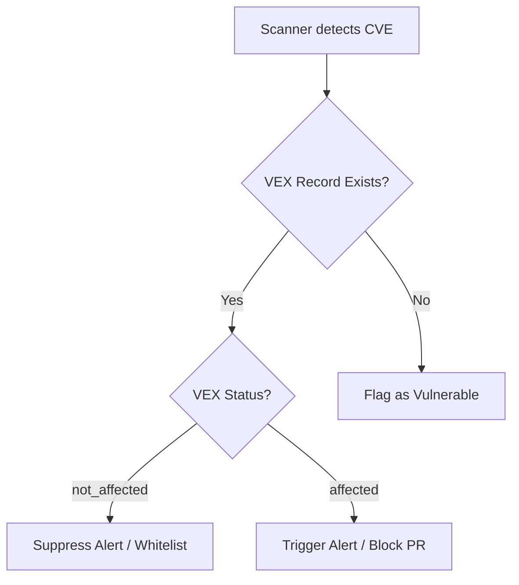

# Vulnerability Exploitability eXchange (VEX) Schema
**Document ID:** VENUS-USPTCROS-083
**Version:** 1.0.0
**Status:** Approved
**Effective Date:** 2026-06-26

## 1. Overview & Objective
Defines the format and integration standard for publishing Vulnerability Exploitability eXchange (VEX) statements. This allows Venus to state whether a detected vulnerability impacts actual application runs.

## 2. Technical Specifications & Architecture


## 3. Code Fragment / Implementation Details
```json
{
  "@context": "https://openvex.dev/ns/v1",
  "@id": "https://openvex.dev/docs/public/vex-venus-001",
  "author": "Venus Security Security Incident Response Team (SIRT)",
  "timestamp": "2026-06-26T15:00:00Z",
  "version": 1,
  "statements": [
    {
      "vulnerability": "CVE-2023-38545",
      "status": "not_affected",
      "justification": "vulnerable_code_not_present",
      "details": "The application does not invoke SOCKS5 proxy components of the curl dependency.",
      "products": [
        "pkg:maven/com.venus.security/core-engine@1.0.0"
      ]
    }
  ]
}
```

## 4. Verification Schema & Configurations
```json
{
  "$schema": "http://json-schema.org/draft-07/schema#",
  "title": "VEXStatementSchema",
  "type": "object",
  "properties": {
    "vulnerability": {
      "type": "string"
    },
    "status": {
      "type": "string",
      "enum": [
        "affected",
        "not_affected",
        "fixed",
        "under_investigation"
      ]
    },
    "justification": {
      "type": "string",
      "enum": [
        "vulnerable_code_not_present",
        "vulnerable_code_not_in_execution_path",
        "inline_mitigation_applied"
      ]
    },
    "products": {
      "type": "array",
      "items": {
        "type": "string"
      }
    }
  },
  "required": [
    "vulnerability",
    "status",
    "products"
  ]
}
```

## 5. Mathematical Formulations & Quantitative Metrics
$$VEX_{suppression\_ratio} = \frac{VEX\_Suppressed\_CVEs}{Total\_Detected\_CVEs}$$

## 6. Institutional Verification Checklist
* [ ] Publish updated VEX statements with every major package release.
* [ ] Verify justifications are signed by a senior security architect.
* [ ] Enforce that VEX metadata is accessible within the internal registry.
* [ ] Verify scanner configurations process OpenVEX declarations before generating alerts.

## 7. Cross-References
- [Sbom Lifecycle Specification](file:///Users/dronpancholi/Developer/01_Strategic/Venus/usptcros_templates/SBOM_LIFECYCLE_SPECIFICATION.md)
- [Static Analysis Quality Gate](file:///Users/dronpancholi/Developer/01_Strategic/Venus/usptcros_templates/STATIC_ANALYSIS_QUALITY_GATE.md)
- [Private Registry Promotion Policy](file:///Users/dronpancholi/Developer/01_Strategic/Venus/usptcros_templates/PRIVATE_REGISTRY_PROMOTION_POLICY.md)
