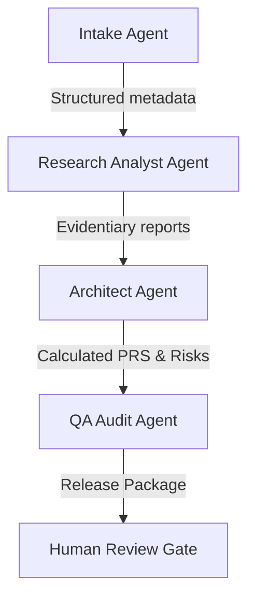

# Project VENUS — AI-Agent Automation Workflows

## 1. Context & Strategy

### 1.1 Purpose
This document defines the orchestration, responsibilities, and handoff protocols for autonomous AI agents executing the Problem Discovery Engine. It ensures that background research, constraint extraction, and verification loops are executed systematically with strict quality control.

### 1.2 Philosophy
Agents are task executors under strict deterministic supervision. We do not allow agents to self-approve deliverables; every agent output must pass an automated checker gate or a human approval step.

---

## 2. Agent Roles & Responsibilities

The engine utilizes four specialized agent roles:

1.  **Intake Agent**: Ingests unstructured inputs, performs duplicate detection, and runs initial classifications.
2.  **Research Analyst Agent**: Queries external APIs, searches academic databases and patent registries, and extracts competitor pricing.
3.  **Architect Agent**: Analyzes constraints, evaluates tech stack candidates, and constructs systems context graphs.
4.  **QA Audit Agent**: Audits registers, calculates the Problem Readiness Score (PRS), checks for logical contradictions, and validates evidence logs.

---

## 3. Parallel Execution & Handoff Pipeline

### 3.1 Orchestration Sequence
1.  **Step 1**: Intake Agent receives input and creates `INT-[UUID]`.
2.  **Step 2**: Research Agent and Architect Agent execute tasks in parallel:
    *   *Research Agent*: Pulls competitor profiles and pricing matrices.
    *   *Architect Agent*: Compiles database constraints and technology options.
3.  **Step 3**: QA Audit Agent aggregates deliverables, checking the Source Validation Matrix and verifying that all assumptions have linked evidence.
4.  **Step 4**: SRE telemetry probes check for system configuration safety.
5.  **Step 5**: Release Certificate compiled and sent to the Human Review queue.

---

## 4. Retrieval & Evidence Verification Rules

### 4.1 Internet & Academic Research Strategy
*   **Search Queries**: Must include domain parameters, patent indices, and CVE security records.
*   **Contradiction Detection**: The QA Agent compares competitor claims against direct user interview logs. If a contradiction is detected (e.g. competitor claims 99.9% uptime but customer interviews report regular crashes), the agent flags the issue as a "High Value Opportunity".
*   **Source Verification**: All citations must map to a credibility rating of 'B' or higher in the Source Validation Matrix.

---

## 5. Reusable Checklists & Agent Safety Gates

### 5.1 Agent Orchestration Gate Rules
*   [ ] Verify that no agent can write directly to the master git branch.
*   [ ] Enforce JSON Schema boundaries on all agent communication payloads.
*   [ ] Require double-agent cross-evaluation for RLS security models.
*   [ ] Log all prompts, temperatures, and model seeds in the audit repository.
