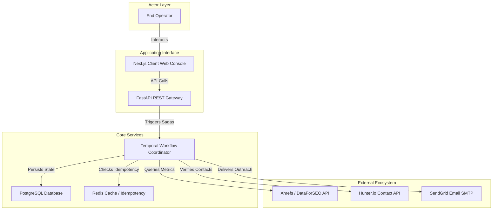

# Module 10 — Systems Context

## 1. Context & Strategy

### 1.1 Purpose
Systems do not operate in isolation. The Systems Context Engine maps the complete organizational, technical, and data ecosystem surrounding the problem space. It identifies all inputs, outputs, third-party APIs, human processes, and database boundaries, ensuring the proposed system integrates without interface friction or architectural drift.

### 1.2 Philosophy
A system is a web of relationships. We cannot define a solution until we map every active connection, data stream, and stakeholder touchpoint.

---

## 2. Systems Context Framework

The engine maps the system across four boundary layers:
1.  **Actor Layer**: Humans (operators, managers, customers) executing processes.
2.  **Interface Layer**: Entry endpoints, Web consoles, CLIs, webhook receivers.
3.  **Core Services Layer**: Business logic, workflow engines (Temporal), databases (PostgreSQL, Redis).
4.  **External Layer**: Third-party APIs, vendor databases, external notification servers.

---

## 3. Inputs & Outputs

### 3.1 Inputs
*   User Journey Map (from Stage 3).
*   Tech Stack Specification (from Stage 5).
*   Constraint Dependency Graph (from Module 7).

### 3.2 Outputs
*   **System Boundary Map (Mermaid)**: Unified data flow and dependency layout.
*   **Ecosystem Interface Registry**: Mapped endpoints and data formats.

---

## 4. Operational Methodology & Ecosystem Mapping

### 4.1 System Boundary Visualization
The engine constructs a visual model mapping data and interaction pathways:



---

## 5. Reusable Checklists & Templates

### 5.1 Systems Context Checklist
*   [ ] Mapped all human actors interfacing with the system.
*   [ ] Documented all external API endpoints and data schemas.
*   [ ] Charted primary database read/write pathways.
*   [ ] Mapped all asynchronous event brokers (e.g., Kafka).
*   [ ] Validated boundary interface points with external vendor docs.

### 5.2 Template: Ecosystem Interface Registry Entry
```markdown
### 1. External Interface: INT-[UUID]
*   **System Partner**: [e.g., Ahrefs API Gateway]
*   **Data Type**: Outbound Query / Inbound JSON payload
*   **Protocol**: REST / HTTPS with API Key Auth
*   *Rate Limit Constraint*: [e.g., Max 10 requests per second]

### 2. Integration Architecture
*   *App Class*: `AhrefsClient` under `clients/ahrefs.py`
*   *Error Handling*: Auto-retry preset with exponential backoff on HTTP 429.
```

---

## 6. SRE, AI-Agent, & Safety Parameters

### 6.1 AI-Agent Execution Instructions
1.  **Map**: Read import blocks and REST routers in the project source.
2.  **Verify**: Cross-check API configurations in `.env.production` against mapped endpoints.
3.  **Identify**: Highlight any undocumented API calls or database write paths, logging them in the registry.

### 6.2 Common Anti-patterns
*   **The Isolated Spec**: Designing a database schema without checking if target third-party APIs match the data fields, leading to manual translation layers in code.
*   **Undocumented Vendor Dependencies**: Relying on external services that lack documented SLA metrics or rate caps.

### 6.3 Exit Criteria
*   System Boundary Map compiled and **Ecosystem Interface Registry validated**.
*   Proceed to **Module 11: AI Opportunity Analysis**.
