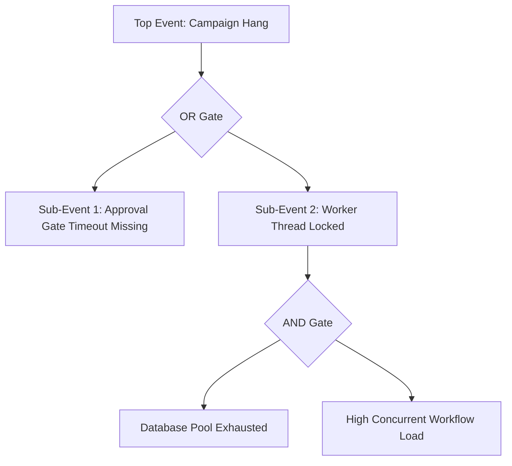

# Module 3 — Root Cause Discovery

## 1. Context & Strategy

### 1.1 Purpose
Root Cause Discovery systematically traces symptoms back to their core technical, operational, and organizational triggers. By mapping failure trees, causal loops, and bottleneck points, it ensures the engineering organization designs solutions for the root issue rather than patching localized errors.

### 1.2 Philosophy
A bug is merely an opinion of the system. We do not patch code until we have mapped the causal chains that allowed the bug to exist in the first place.

---

## 2. Root Cause Discovery Framework

We decompose failures into six structural layers:

```
[Symptom] (e.g., Worker memory crash)
   │
   ▼
[Immediate Cause] (e.g., Large dataset query in single process)
   │
   ▼
[Systemic Cause] (e.g., Caching strategy absent; no pagination bounds)
   │
   ▼
[Latent Cause] (e.g., Scale limits not defined in developer specs)
   │
   ▼
[Organizational Cause] (e.g., No performance review gate in CI)
   │
   ▼
[External / Environmental Cause] (e.g., Outsized customer tenant data ingress)
```

---

## 3. Inputs & Outputs

### 3.1 Inputs
*   Classification Vector Matrix (from Module 2).
*   System logs, database schemas, and stack traces.
*   Interview notes from the end-operators.

### 3.2 Outputs
*   **Root Cause Tree (Mermaid)**: Structural flowchart mapping the causal chain.
*   **Causal Loop Diagram**: Visual map of the feedback loops driving the problem.
*   **Root Cause Verdict**: Isolated definition of the core failure trigger.

---

## 4. Operational Methodology & Tools

### 4.1 Fishbone (Ishikawa) Analysis
Decompose failure vectors into six branches:
*   *Machine* (Infrastructure, Database, Cloud)
*   *Method* (Software Architecture, Code Flow)
*   *Material* (Data Inputs, API payloads)
*   *Measure* (Metrics, Logs, Telemetry gaps)
*   *Mother Nature* (Environment configurations)
*   *Manpower* (Operator errors, training gaps)

### 4.2 Fault Tree Analysis (FTA)
Construct a top-down logical diagram modeling the failure:



---

## 5. Reusable Templates & Checklists

### 5.1 Root Cause Checklist
*   [ ] Traced the symptom through the 5 Whys path.
*   [ ] Completed a Fishbone diagram covering infrastructure and code.
*   [ ] Mapped the active feedback loops causing the issue.
*   [ ] Validated assumptions against live system database logs.
*   [ ] Formulated the final Root Cause Verdict.

### 5.2 Template: Root Cause Discovery Report
```markdown
### 1. Failure Event Summary
*   **Symptom Description**: [What went wrong?]
*   **Impact Scope**: [Which components/tenants were affected?]

### 2. Five Whys Trace
*   *Why 1*: [Immediate cause]
*   *Why 2*: [Systemic trigger]
*   *Why 3*: [Architecture limitation]
*   *Why 4*: [Process/Spec omission]
*   *Why 5*: [Root / Latent cause]

### 3. Causal Diagram (Mermaid)
```mermaid
[Paste Mermaid diagram of Root Cause Tree / Fault Tree here]
```

### 4. Root Cause Verdict
*The primary driver of the failure event is:* [Insert verified root cause here]
```

---

## 6. SRE, AI-Agent, & Safety Parameters

### 6.1 AI-Agent Execution Instructions
1.  **Parse**: Read stack traces and query execution logs.
2.  **Correlate**: Build the Fault Tree using AND/OR gates.
3.  **Validate**: Verify if the hypothesized root cause is supported by log data (e.g. database execution durations). If not, regenerate the hypothesis.

### 6.2 Common Anti-patterns
*   **The Single-Trigger Illusion**: Assuming a failure has only one cause, ignoring the systemic factors (e.g., blaming a developer for code error, ignoring a lack of test coverage in the CI pipeline).
*   **Stopping at Symptoms**: Addressing the immediate cause (e.g., rebooting server to clear memory) without identifying the underlying memory leak source.

### 6.3 Exit Criteria
*   Root Cause Tree mapped, and the **Root Cause Verdict signed-off** with log evidence.
*   Proceed to **Module 4: Stakeholder Intelligence**.
