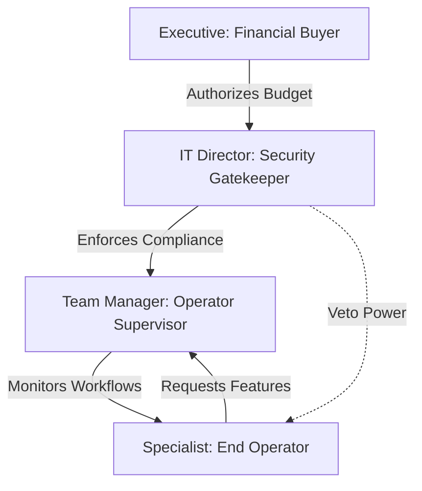

# Module 4 — Stakeholder Intelligence

## 1. Context & Strategy

### 1.1 Purpose
Systems fail commercially and organizationally when they violate the incentives, objectives, or fears of critical stakeholders. Stakeholder Intelligence identifies all parties (operators, buyers, legal, regulators) affected by the problem space, mapping their objectives and conflicts to ensure the system is aligned for adoption and compliance.

### 1.2 Philosophy
An engineering solution must satisfy the user's workflow, the buyer's budget, the security officer's compliance parameters, and the executive's ROI expectations. If any group is ignored, the product will be rejected.

---

## 2. Stakeholder Intelligence Matrix

For every project, the engine maps stakeholders across six primary vectors:
1.  **Incentives**: What drives their behavior and compensation?
2.  **Fears**: What risks or errors do they actively avoid?
3.  **Objectives**: What outcomes must this system deliver for them?
4.  **KPIs**: How is their success measured?
5.  **Constraints**: What limitations (legal, budgetary, technical) govern their action?
6.  **Conflicts**: Where do their goals oppose other stakeholders?

---

## 3. Inputs & Outputs

### 3.1 Inputs
*   Verified Problem Statement (from Stage 1).
*   Organizational charts of target customers.
*   User interview records (from Stage 3).

### 3.2 Outputs
*   **Stakeholder Incentive Registry**: Mapped profiles for all participants.
*   **Influence Map (Mermaid)**: Visual map of authority and communication links.
*   **Conflict Assessment Brief**: Highlighted areas of friction.

---

## 4. Operational Methodology & Visual Mapping

### 4.1 Influence Mapping
The engine maps the relationship and influence level of each stakeholder group:



---

## 5. Reusable Checklists & Templates

### 5.1 Stakeholder Research Checklist
*   [ ] Identified the end-user, manager, buyer, and compliance auditor.
*   [ ] Documented the direct incentives of the purchasing agent.
*   [ ] Mapped the primary concerns of the IT security officer.
*   [ ] Charted the influence relationships among stakeholders.
*   [ ] Logged all conflicting incentives in the register.

### 5.2 Template: Stakeholder Analysis Dossier
```markdown
### 1. Stakeholder Profile: [e.g., Security Compliance Officer]
*   **Organizational Role**: Security Gatekeeper
*   **Direct Incentives**: Zero data breaches, full regulatory compliance.
*   **Primary Fears**: Data leaks, non-encrypted PII, unverified API endpoints.
*   **Key KPIs**: Compliance pass rate (SOC 2, GDPR).
*   **System Action Mandated**: Implement PostgreSQL Row-Level Security (RLS) and OAuth validation.

### 2. Conflict Register
*   *Conflict*: The End-Operator wants rapid database inserts bypassing RLS session checks, but the Security Officer requires full query auditing.
*   *Resolution*: Enforce automated Postgres session variables via middleware, keeping validation invisible to the operator.
```

---

## 6. SRE, AI-Agent, & Safety Parameters

### 6.1 AI-Agent Execution Instructions
1.  **Extract**: Identify all titles and roles mentioned in user interviews.
2.  **Infer**: Map their likely metrics and concerns based on standard B2B enterprise buying committee schemas.
3.  **Flag**: If a critical stakeholder group (e.g. Legal or Security) has zero mapped requirements, throw a validation warning.

### 6.2 Common Anti-patterns
*   **The Operator-Only Focus**: Designing software that operators love but IT departments reject due to lack of encryption or audit features.
*   **The Buyer-Only Focus**: Building dashboard software that executives buy but operators refuse to use due to high latency or cognitive load.

### 6.3 Exit Criteria
*   Stakeholder Incentive Registry compiled with **Influence Map validated**.
*   Proceed to **Module 5: Assumption Discovery**.
