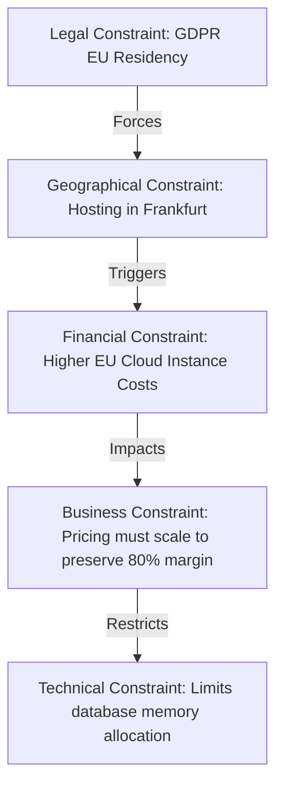

# Module 7 — Constraint Discovery

## 1. Context & Strategy

### 1.1 Purpose
Constraint Discovery maps the absolute limits (technical, legal, budgetary, operational, physical) that govern the project. By identifying these boundary lines early, it prevents the engineering organization from designing architectures that violate immutable constraints.

### 1.2 Philosophy
Constraints are not blockers; they are design parameters. The more clearly the boundary constraints are defined, the more precise and optimal the resulting architecture will be.

---

## 2. Constraint Taxonomy

We catalog and track constraints across fourteen distinct vectors:

| Constraint Category | Definition / Boundary | Example |
|---|---|---|
| **Technical** | Hardware or logical limits | Database write throughput ceiling |
| **Business** | Commercial targets | Must support $299/mo tier pricing |
| **Financial** | Budget allocations | Max cloud spend limit: $500/mo |
| **Legal** | Corporate laws, copyright | Prohibits GPLv3 code in proprietary app |
| **Operational** | DevOps/uptime boundaries | 99.9% uptime target; max 1h RTO |
| **Security** | Compliance bounds | Tenant isolation must be RLS-based |
| **AI** | Inference limits | Context token ceiling; output drift |
| **Infrastructure**| Hosting parameters | Must run on AWS Fargate |
| **Performance** | Latency thresholds | API gateway response must be < 100ms |
| **Human** | Personnel limits | Current team has no Rust developers |
| **Time** | Timeline deadlines | Demo environment required by Q3 |
| **Geographical** | Location constraints | EU tenant data cannot leave Frankfurt region |
| **Regulatory** | Statutory rules | Compliance with EU AI Act |
| **Environmental** | Energy / footprint | Target CO2 compute footprint limits |

---

## 3. Inputs & Outputs

### 3.1 Inputs
*   Market Intelligence Dossier (from Stage 2).
*   Tech Stack Specification (from Stage 5).
*   Assigned Engineering Scopes (from Module 2).

### 3.2 Outputs
*   **Constraint Register**: Comprehensive table tracking all project boundaries.
*   **Constraint Dependency Graph (Mermaid)**: Visual map illustrating boundary crossovers.

---

## 4. Operational Methodology & Dependency Mapping

### 4.1 Dependency Graph Construction
The engine maps how individual constraints trigger secondary limits:



---

## 5. Reusable Checklists & Templates

### 5.1 Constraint Research Checklist
*   [ ] Documented all database write/read throughput limits.
*   [ ] Vetted open-source licenses for legal constraints.
*   [ ] Mapped data residency constraints across EU and US.
*   [ ] Mapped team capabilities (identifying skill gaps).
*   [ ] Created the Constraint Dependency Graph.

### 5.2 Template: Constraint Register Entry
```markdown
### 1. Constraint Profile: CON-[UUID]
*   **Description**: "[e.g., EU tenant data must reside strictly in the Frankfurt cloud datacenter]"
*   **Category**: Geographical / Regulatory / Legal
*   *Severity*: Critical (Non-negotiable)
*   **Trigger Condition**: When tenant country code is EU.

### 2. Architectural Resolution
*   *Implementation Strategy*: Configure dynamic route mapping in the API gateway. Direct queries for EU tenant schemas to RDS instances bound to the `eu-central-1` subnet.
*   *Verification method*: Execute Automated integration test checking DB connection region for mock EU account.
```

---

## 6. SRE, AI-Agent, & Safety Parameters

### 6.1 AI-Agent Execution Instructions
1.  **Parse**: Read Terraform files, package locks, and database configurations.
2.  **Verify**: Check that subnet definitions match geographical data residency rules.
3.  **Flag**: If any query path crosses data residency borders (e.g. US host calling EU database), trigger an immediate isolation alert.

### 6.2 Common Anti-patterns
*   **The Implicit Constraint Omission**: Failing to document latency thresholds (e.g. building a complex multi-agent system that takes 45 seconds to generate output, violating the user's 5-second attention span constraint).
*   **Violating licensing constraints**: Accidentally importing AGPL code into a SaaS backend, violating legal boundaries.

### 6.3 Exit Criteria
*   Constraint Register compiled and **Constraint Dependency Graph validated**.
*   Proceed to **Module 8: Opportunity Discovery**.
