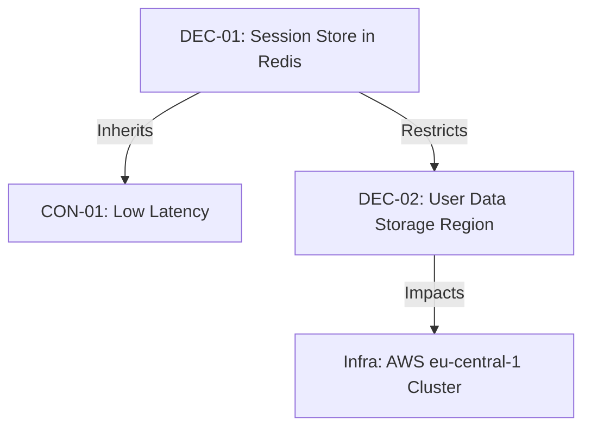

# Module 27 — Decision Knowledge Graph

## 1. Context & Strategy

### 1.1 Purpose
The Decision Knowledge Graph maps the network of decisions, illustrating how choices in one domain (e.g. database type) trigger downstream impacts in other layers (e.g. security rules, costs).

### 1.2 Philosophy
Decisions are not isolated events. They form a web of cause-and-effect dependencies. We map these relationships to identify systemic points of failure and hidden loops.

---

## 2. Ingest Parameters & Taxonomy

### 2.1 Inputs & Outputs
*   **Inputs**: Active ADR registers and dependency matrices.
*   **Outputs**: Knowledge Graph representation (Mermaid or JSON) detailing system connections.

### 2.2 Node & Edge Taxonomy
*   **Nodes**: Decisions (DEC-ID), Code components, Cloud resources, Constraints.
*   **Edges**: Impacts / Restricts / Inherits / Violates.

---

## 3. Operational Algorithm & Graph Mapping

### 3.1 Graph Construction Pipeline
```
                          [Parse Active ADR Files]
                                     │
                        [Identify Relationship Tags]
                                     │
                       [Build Node & Edge Registry]
                                     │
                       [Generate Mermaid Visual Map]
```

### 3.2 Dynamic Impact Calculation
When a change is proposed for a specific node, the engine traverses downstream edges to locate affected components, listing all systems that require re-evaluation.

---

## 4. Reusable Templates & Checklists

### 4.1 Template: Decision Dependency Graph


### 4.2 Checklist
*   [ ] Parsed all new ADR files for dependency tags.
*   [ ] Checked cloud resource names.
*   [ ] Updated Node Registry.
*   [ ] Generated Mermaid visual representation.

---

## 5. SRE, AI-Agent, & Safety Parameters

### 5.1 AI-Agent Execution Instructions
1.  **Traverse**: Run network depth-first search (DFS) starting from the proposed change node.
2.  **Verify**: If a proposed change impacts a security node downstream, flag the change for audit sign-offs.

### 5.2 Common Anti-patterns
*   *The Siloed Alteration*: Changing a database index configuration without tracing how it impacts downstream reporting runtimes or billing limits.

### 5.3 Exit Criteria
*   Decision Knowledge Graph updated and **visual dependency map validated**.
*   Proceed to **Module 28: Autonomous Decision Agent**.
