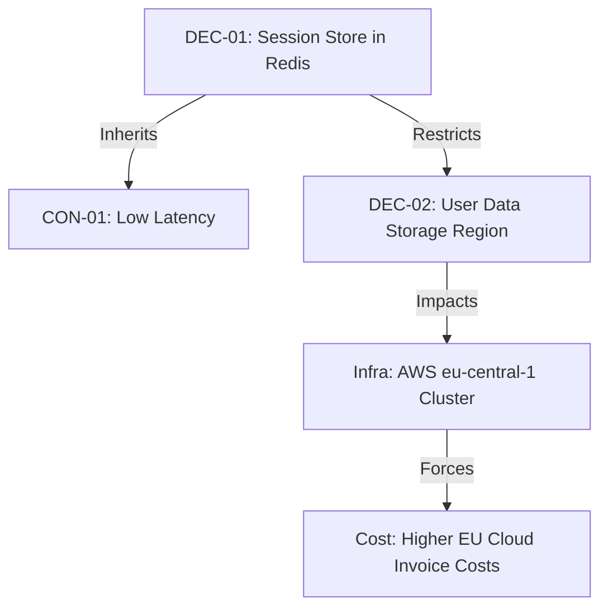

# Template: Decision Knowledge Graph

## 1. Document Control
*   **Project Name**: [Project Name]
*   **Intake ID**: INT-[UUID]
*   **Graph ID**: DKG-[UUID]
*   **Last Updated**: [Date]

---

## 2. System Relationship Map (Mermaid)
*Visualize the node connections and downstream impacts of active decisions.*

---

## 3. Node & Edge Registry

| Source Node | Edge Relationship | Destination Node | Description / Impact |
|---|---|---|---|
| **DEC-01** (Redis Session) | Inherits | **CON-01** (Low Latency) | Redis cache helps meet the latency threshold. |
| **DEC-01** (Redis Session) | Restricts | **DEC-02** (Data Region) | Redis server locations must align with EU residency. |
| **DEC-02** (Data Region) | Impacts | **INF-01** (AWS eu-central-1) | Forces deployment of resources in Germany. |
