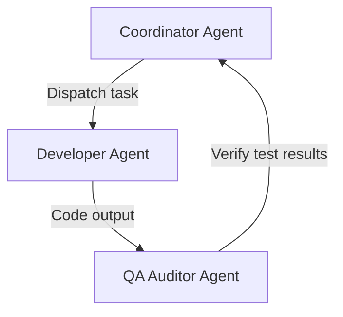

# Template: Agent Collaboration Blueprint

## 1. Document Control
*   **Project Name**: [Project Name]
*   **Blueprint ID**: AGT-[UUID]

---

## 2. Multi-Agent Topology Map (Mermaid)
*Visualize the communication flow, handoffs, and validation gates of the agent team.*



---

## 3. Agent Protocol & Messaging Schema
Agents communicate using structured JSON payloads over an internal bus:

```json
{
  "sender_id": "agent-dev-01",
  "recipient_id": "agent-qa-01",
  "message_type": "CODE_REVIEW_REQUEST",
  "payload": {
    "pr_number": 42,
    "target_files": ["utils.py"]
  }
}
```

---

## 4. Operational Safety Controls
*   **Infinite Loop Prevention**: Enforce a maximum execution limit of 10 tool calls per single agent task.
*   **Budget Ceiling**: Kill agent process if billing exceeds $5.00 per single run.
*   *Human Verification Gate*: Enforce manual approval prior to executing git push or deploying to staging.
