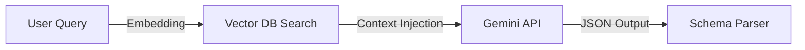

# Template: AI Architecture Specification

## 1. Document Control
*   **Project Name**: [Project Name]
*   **AI Spec ID**: AI-SPC-[UUID]

---

## 2. AI Topology Definition
*Define the selected AI configuration (LLM, RAG, Multi-Agent Swarms).*

*   **Selected Topology**: RAG + Cloud LLM (Gemini 1.5 Flash).
*   **Justification**: Context contains unstructured customer support data; semantic vector retrieval is needed.

---

## 3. RAG Pipeline Topology (Mermaid)

---

## 4. Model Selection & Configuration Parameters
*   **Model Provider**: Google Gemini API.
*   **Target Model**: `gemini-1.5-flash-latest`.
*   **Temperature**: 0.2 (High determinism).
*   **Max Output Tokens**: 1024 tokens.
*   **System Prompt Boundary**: [Link to System Instructions file]
