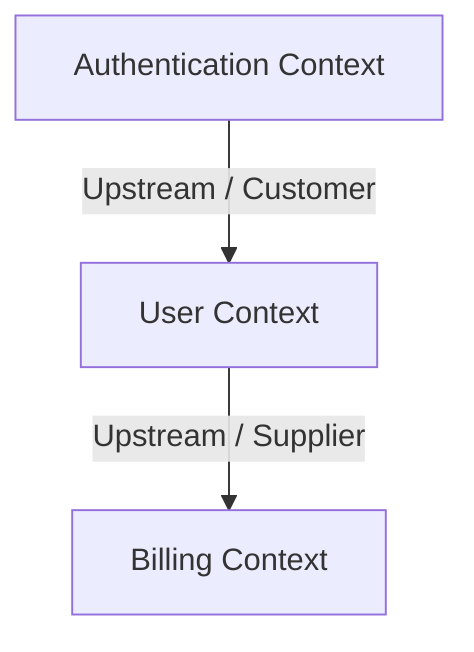

# Template: Context Map

## 1. Document Control
*   **Project Name**: [Project Name]
*   **Decision ID**: DEC-[UUID]
*   **Date**: [Date]

---

## 2. Domain Context Boundaries Diagram (Mermaid)
*Visualize the bounded contexts and their relationships (Customer-Supplier, Shared Kernel, Conformist).*

---

## 3. Relationship Registry

| Upstream Context | Downstream Context | Relationship Type | Communication Channel |
|---|---|---|---|
| **Authentication** | User Profile | Customer-Supplier | Internal gRPC / Protobuf |
| **User Profile** | Billing Context | Shared Kernel | Database Row Sharing |

---

## 4. Integration Specifications
*   *Authentication & User Profile Interface*: [Describe the gRPC schemas and authentication tokens exchanged]
*   *User Profile & Billing Interface*: [Describe database structures and events]
