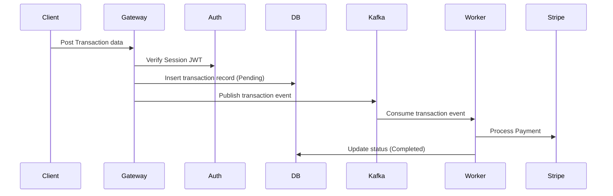

# Template: Data Flow Specification

## 1. Document Control
*   **Project Name**: [Project Name]
*   **Flow ID**: FLO-[UUID]

---

## 2. Dynamic Data Flow Map (Sequence)
*Trace the path of data packages from client input to persistence and analytics targets.*

---

## 3. Data Transformation & Validation
*   **Ingest Schema**: Raw JSON payload validated using Zod / Pydantic schemas.
*   **PII Masking**: Session fields (password, raw card number) are masked or zeroed at boundary layers.
*   **Audit Logging**: Write operations append transactional logs to cloud watch records.
