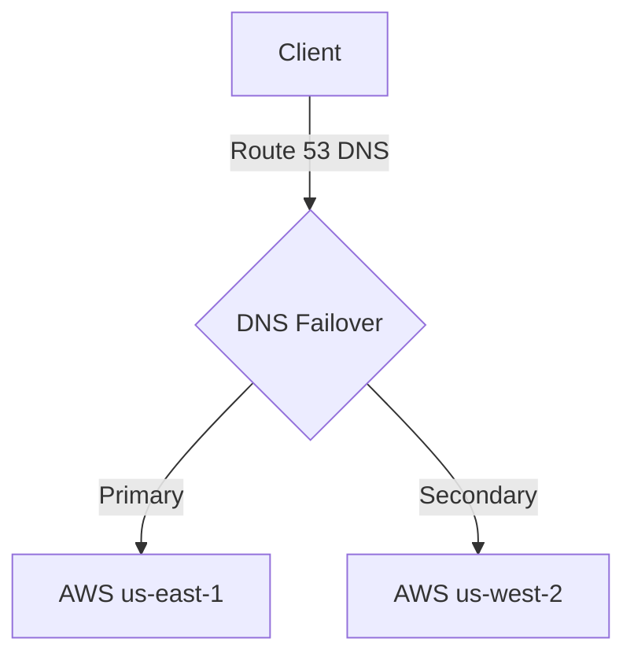

# Template: High Availability Plan

## 1. Availability SLOs
*   **Target Availability**: [e.g., 99.99% Availability (Max 52.56 minutes downtime / year)]
*   **Target SLA**: [e.g., 99.9%]

---

## 2. Redundancy & Failover Topology

---

## 3. Component Failover Configurations

| Component | Redundancy Strategy | Failover Trigger | Recovery Time (RTO) |
|---|---|---|---|
| **API Load Balancer** | Active-Active Multi-region | Health check failure (3 retries) | < 10 seconds |
| **Primary Database** | Multi-AZ replica replication| Master node heartbeat timeout | < 30 seconds |
| **Worker Containers** | Autoscaling group spread | Host VM health check timeout | < 60 seconds |

---

## 4. Verification & Active Chaos Testing
*   **Chaos Engineering Scenario**: Terminate master database node during peak simulated load.
*   **Success Criteria**: Passive replica promoted to master automatically within 30 seconds with zero transaction losses.
