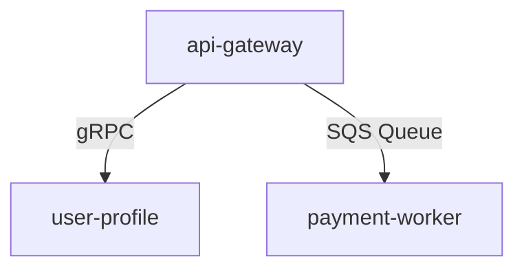

# Template: Service Catalog

## 1. Active Services Directory
*Track and catalog all microservices, API servers, and worker nodes in the ecosystem.*

| Service Name | Description | Protocol | Port | Owner | Repo Link |
|---|---|---|---|---|---|
| **api-gateway** | Handles routing, authentication | HTTP 1.1 / REST | 3000 | Core Team | [Repo Link] |
| **user-profile**| Manages user database schemas | gRPC / Protobuf | 50051| User Team | [Repo Link] |
| **payment-worker**| Processes transactional payments | Event-driven (SQS) | N/A | Billing Team| [Repo Link] |

---

## 2. Service Dependency Matrix

---

## 3. SLA Uptime Targets
*   **api-gateway**: Target 99.99% Availability | Max MTTR 15 mins.
*   **user-profile**: Target 99.9% Availability | Max MTTR 30 mins.
*   **payment-worker**: Target 99.5% Availability | Max MTTR 1 hour.
