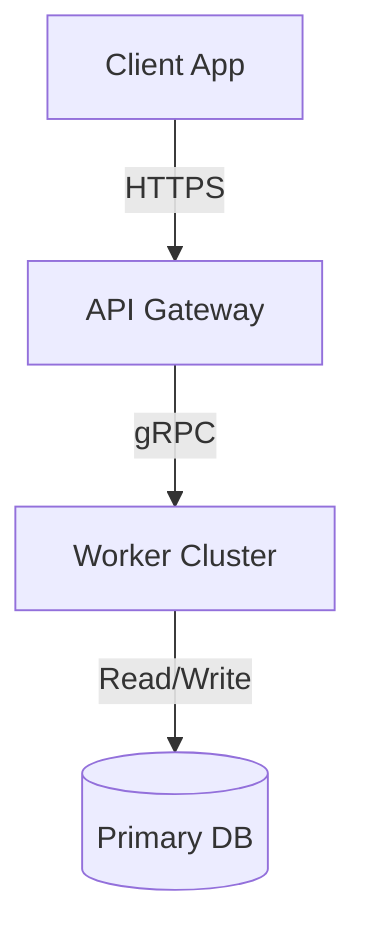

# Template: System Architecture Blueprint

## 1. Document Control
*   **Project Name**: [Project Name]
*   **Blueprint ID**: BLU-[UUID]
*   **Date**: [Date]
*   **Lead Architect**: [Name]

---

## 2. Executive Architectural Summary
*Provide a concise summary of the system architecture design (Monolith, Microservices, Cell).*

---

## 3. High-Level Systems Topology (Mermaid)
*Visualize the high-level components and communication boundaries.*

---

## 4. Key Architectural Patterns Used
*   *Pattern 1*: [e.g., Cell Architecture for tenant isolation]
*   *Pattern 2*: [e.g., Clean Architecture for core business logic]

---

## 5. Architectural Quality Attributes
*   **Scalability Target**: [e.g., Tier 4 (100,000 users)]
*   **Availability Target**: [e.g., 99.9% uptime]
*   **Security standard**: Zero-trust, end-to-end TLS encryption.
