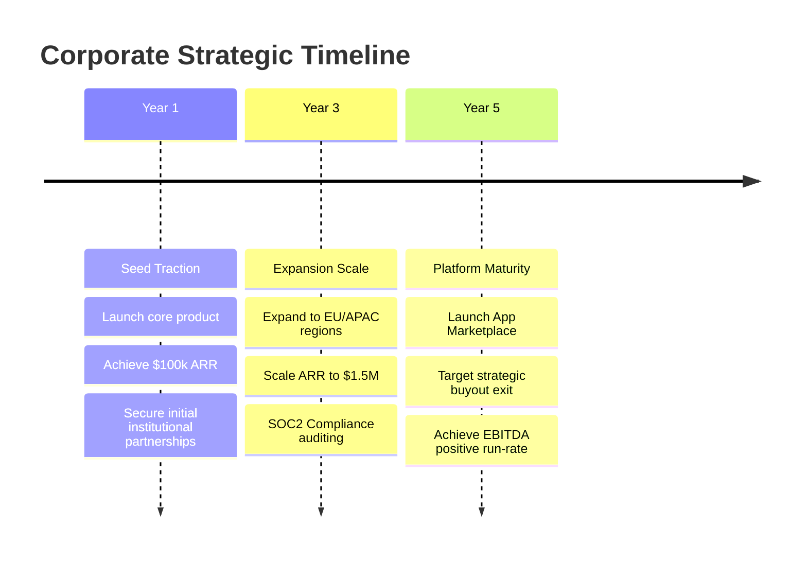

# Template: Strategic Roadmap

## 1. Document Control
*   **Project Name**: [Project Name]
*   **Report ID**: STR-MAP-[UUID]
*   **Last Updated**: [YYYY-MM-DD]

---

## 2. Multi-Year Strategic Milestones

---

## 3. Horizon Milestones & Financial Objectives

### Horizon A (Months 1 - 12): Product-Market Fit & Seed Traction
*   **Key Strategic Objective**: Validate willingness to pay (WTP) across 50 core ICP enterprise targets.
*   **Financial Milestone**: Reach $10,000 Monthly Recurring Revenue (MRR) with Gross Margins >= 80%.
*   **Funding Milestone**: Raise $500,000 pre-seed or seed capital using completed [Investor Memorandum](./INVESTOR_MEMORANDUM.md).

### Horizon B (Months 13 - 36): Channel Optimization & Scale
*   **Key Strategic Objective**: Shift primary sales motion from founder-led sales to scalable product-led growth (PLG) + outbound sales reps.
*   **Financial Milestone**: Reach $1,500,000 Annual Recurring Revenue (ARR).
*   **Compliance Milestone**: Complete SOC2 Type II certification audit to clear enterprise procurement blocks.

### Horizon C (Months 37 - 60): Ecosystem Dominance & Liquidity Event
*   **Key Strategic Objective**: Position platform as the industry standard system of record, enabling developer APIs and partner integrations.
*   **Liquidity Goal**: Execute strategic acquisition exit with valuation multiples targeting >12x ARR.
