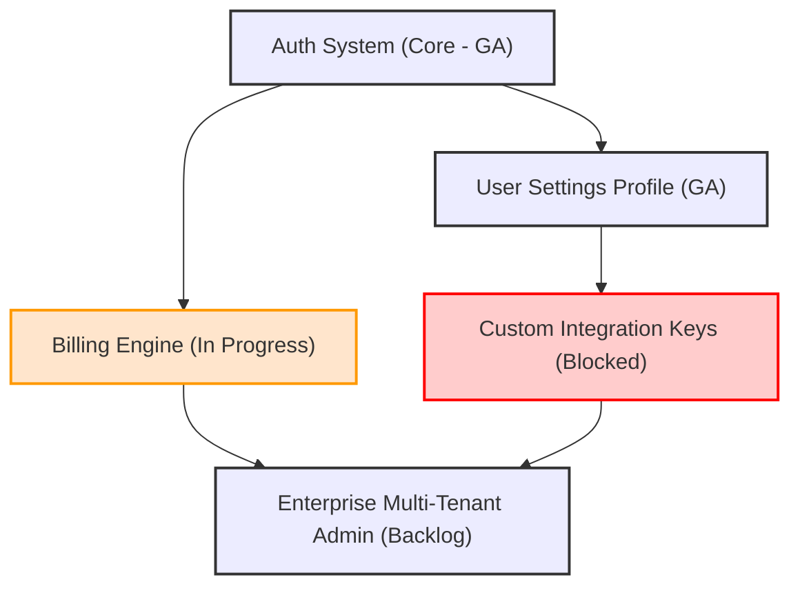

# Feature Dependency Graph Specification

## 1. Document Overview
This document maps technical, visual, and operational dependencies across features. It identifies blockers, highlights critical paths, and evaluates risk profiles using quantitative dependency scoring to ensure stable product releases.

---

## 2. Mermaid Dependency Graph
Use this visual diagram to map relationships between features. Node types indicate status (e.g., Completed, In Progress, Blocked).

---

## 3. Dependency Registry Table
Document each dependency relationship in detail using the table below.

### Dependency Types:
*   **Technical (T):** Code or architectural dependency (e.g., API must exist before front-end work starts).
*   **Design (D):** Visual asset or UX flow dependency.
*   **Resource (R):** Staff or database infrastructure limitations.
*   **Policy (P):** Legal, compliance, or security approval required.

| Feature ID | Feature Name | Dependent On (ID/Name) | Dependency Type | Risk Level | Blocker Status | Mitigation / Workaround |
| :--- | :--- | :--- | :---: | :---: | :---: | :--- |
| *F-101* | *SSO Integration* | *F-100: Auth System* | *T* | *Medium* | *Active* | *Use mock token auth endpoints for local development.* |
| *F-102* | *Team Management* | *F-101: SSO Integration*| *T / D* | *High* | *Blocked* | *Bypassed; design team finalizing layout wireframes.* |
| | | | | | | |
| | | | | | | |

---

## 4. Dependency Risk Score (DRS) Calculation
For high-risk or complex dependencies, calculate the DRS to prioritize mitigation.

$$DRS = \text{Criticality} \times \text{Complexity} \times \text{Availability}$$

### Scoring Matrix (1 to 5 Scale):
1.  **Criticality ($Cr$):** How vital is the dependency to the core system?
    *   *5:* App is dead without it (e.g., Database connection).
    *   *1:* Nice-to-have visual transition.
2.  **Complexity ($Cx$):** How difficult is the dependency to build or configure?
    *   *5:* Multi-system refactor; external API.
    *   *1:* Simple UI state toggle.
3.  **Availability ($Av$):** Are there simple workarounds or alternative approaches?
    *   *5:* No workaround exists.
    *   *1:* Can easily mock data or run offline.

### DRS Calculation Table:
| Dependency Target | Criticality ($Cr$) | Complexity ($Cx$) | Availability ($Av$) | DRS Score* | Risk Category |
| :--- | :---: | :---: | :---: | :---: | :--- |
| *Stripe payment webhook* | *5* | *3* | *4* | **60** | **High Risk** |
| *User Avatar upload* | *2* | *2* | *1* | **4** | **Negligible Risk** |
| | | | | | |

*\*DRS Risk Thresholds:*
*   *Score $\ge 50$: **High Risk** (Requires immediate architecture review and P0 fallback design).*
*   *Score 20-49: **Medium Risk** (Requires weekly check-in).*
*   *Score $< 20$: **Low Risk** (No special action required).*

---

## 5. Architectural Safeguards (De-coupling Guidelines)
To prevent circular dependencies and cascade failures, developers must follow these principles:

1.  **Interface Segregation:** Always develop features against interfaces or APIs, rather than concrete implementations. Mock database layers during early stages.
2.  **Circuit Breakers:** If an external system (e.g., Stripe, Hubspot) is slow or down, implement circuit breaker patterns in code to prevent the application from crashing.
3.  **Feature Flags:** Wrap all new dependencies in a feature flag so they can be toggled off instantly in production without redeploying code.

---

## 6. Revision History
*   **V1.0 (2026-06-26):** Initial creation of Feature Dependency Graph template.
