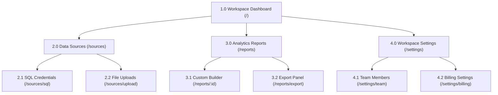

# Information Architecture (IA) Tree Specification

## 1. Document Overview
This document specifies the information architecture, site navigation hierarchy, URL patterns, and role-based access controls for all views in the product. It ensures logical categorization of pages, simple wayfinding paths, and secure routing.

---

## 2. Visual IA Tree
Use this diagram to map the nesting level and navigation routing of the application.

---

## 3. IA Node Registry & Routing Schema
Detail every node represented in the visual hierarchy map.

### Access Levels (RBAC):
*   **Admin:** Full read/write; billing control.
*   **Editor:** Read/write to dashboards and data sources.
*   **Viewer:** Read-only access to analytics dashboards; no settings control.
*   **All:** Available to unauthenticated or general users.

| Node ID | View / Page Name | Parent Node | URL Path Pattern | Access Level (RBAC) | WCAG ARIA Role | Description |
| :---: | :--- | :--- | :--- | :---: | :---: | :--- |
| **1.0** | Workspace Dashboard | `None` (Root) | `/` | Editor | `main` | Primary home workspace; lists recent reports. |
| **2.0** | Data Sources | `1.0` | `/sources` | Editor | `navigation` | Interface to add and configure database connections. |
| **2.1** | SQL Credentials | `2.0` | `/sources/sql` | Admin | `form` | Input fields for server host, port, database name. |
| **4.2** | Billing Settings | `4.0` | `/settings/billing` | Admin | `region` | Credit card updater, subscription change modal. |
| | | | | | | |

---

## 4. Navigation & Wayfinding Standards
To help users understand their current location in the application hierarchy, the following navigation standards are enforced:

### 4.1. Breadcrumb Trails
*   **Trigger:** Display breadcrumbs on all nodes with a depth $\ge 2$ (e.g., Node 2.1).
*   **Format:** `Parent Node Name > Child Node Name > Current Page`.
*   **Example:** `Data Sources > SQL Credentials`
*   **Interactivity:** Parent node names in the breadcrumb path must be clickable links.

### 4.2. Navigation Menus (Sidebar & Topbar)
*   **Sidebar State:** The sidebar navigation must explicitly highlight the active section (e.g., if on Node 2.1, the "Data Sources" sidebar parent item must be shown in an active state).
*   **Target Selection Indicator:** Active menu elements must have a high contrast indicator (e.g., vertical color bar, $\ge 4.5:1$ contrast ratio).

---

## 5. Global Search Indexing
Define the elements that must be indexed and searchable via the global search command panel (`Cmd + K` or `Ctrl + K` menu).

| Search Index | Source Table | Search Matching Key | Redirect Destination URL |
| :--- | :--- | :--- | :--- |
| *Reports* | `reports` | `report_title`, `creator_name` | `/reports/:id` |
| *Data Sources* | `sources` | `source_alias`, `host_ip` | `/sources` |
| *Settings Pages* | *Static* | `page_title`, `synonym_tags` | `/settings/:page` |
| | | | |

---

## 6. Revision History
*   **V1.0 (2026-06-26):** Initial creation of Information Architecture template.
