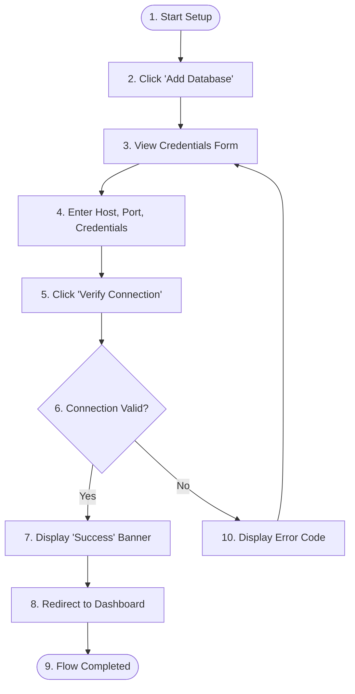

# Task Flow Specification

## 1. Document Overview
This document specifies the task flow for a key user workflow. It details the step-by-step interactions between the user and the system, including state changes, screen transitions, and decision branches.

---

## 2. Target Workflow Parameters
*   **Workflow Name:** `[e.g., Database Connection Setup]`
*   **Target User Persona:** `[e.g., Data-driven Dave]`
*   **Pre-conditions:** [What must be true before starting? e.g., User is logged in; has active administrative privileges.]
*   **Post-conditions:** [What must be true after completion? e.g., Database connection is verified and query dashboard is unlocked.]

---

## 3. Mermaid Task Flow Diagram
Visual representation of the user steps, system processes, and decision points.

---

## 4. Step-by-Step Flow Specification
Detail every step of the flowchart, mapping user actions to system behavior.

| Step # | User Action / Trigger | Screen / UI Element | System Response | Data State Change | Decision / Next Step |
| :---: | :--- | :--- | :--- | :--- | :--- |
| **1** | Clicks "Add Source" button. | Dashboard Sidebar | Navigates to Source Selection layout. | `UIState.currentView = 'add_source'` | Proceed to Step 2. |
| **2** | Selects "PostgreSQL" icon. | Source Choice Grid | Loads the connection parameters form template. | `UIState.targetSource = 'postgres'` | Proceed to Step 3. |
| **3** | Fills in credentials; clicks "Verify". | Credentials Form | Sends connection payload to backend API (`/api/verify`). | `DBConnectionState = 'testing'` | If response code is `200` $\rightarrow$ Step 4. If `403/500` $\rightarrow$ Step 5. |
| **4** | Views success message; clicks "Go". | Success Modal | Saves credentials to DB; redirects to Workspace. | `DBConnectionState = 'connected'` | Flow completed successfully. |
| **5** | Reads error message; updates host IP. | Credentials Form | Displays inline validation error (e.g., "Timeout"). | `DBConnectionState = 'failed'` | Return to Step 3. |

---

## 5. Branching & Alternative Paths
Describe alternate pathways that depart from the primary success path:

### 5.1. Alternative Path A: Database Behind Firewall
*   **Trigger:** Connection fails with a `Network Timeout (504)` during Step 3.
*   **System Action:**
    1.  Detect timeout error.
    2.  Display modal: "Postgres database appears to be behind a firewall."
    3.  Provide the application's Static NAT IP addresses for whitelisting.
    4.  Offer a "Retry Connection" button.

### 5.2. Alternative Path B: Cancel Mid-Flow
*   **Trigger:** User clicks "Cancel" or closes the browser window.
*   **System Action:**
    1.  Prompt the user: "Are you sure? Unsaved changes will be lost."
    2.  If confirmed, discard input data and redirect to dashboard.

---

## 6. Revision History
*   **V1.0 (2026-06-26):** Initial creation of Task Flow Specification template.
