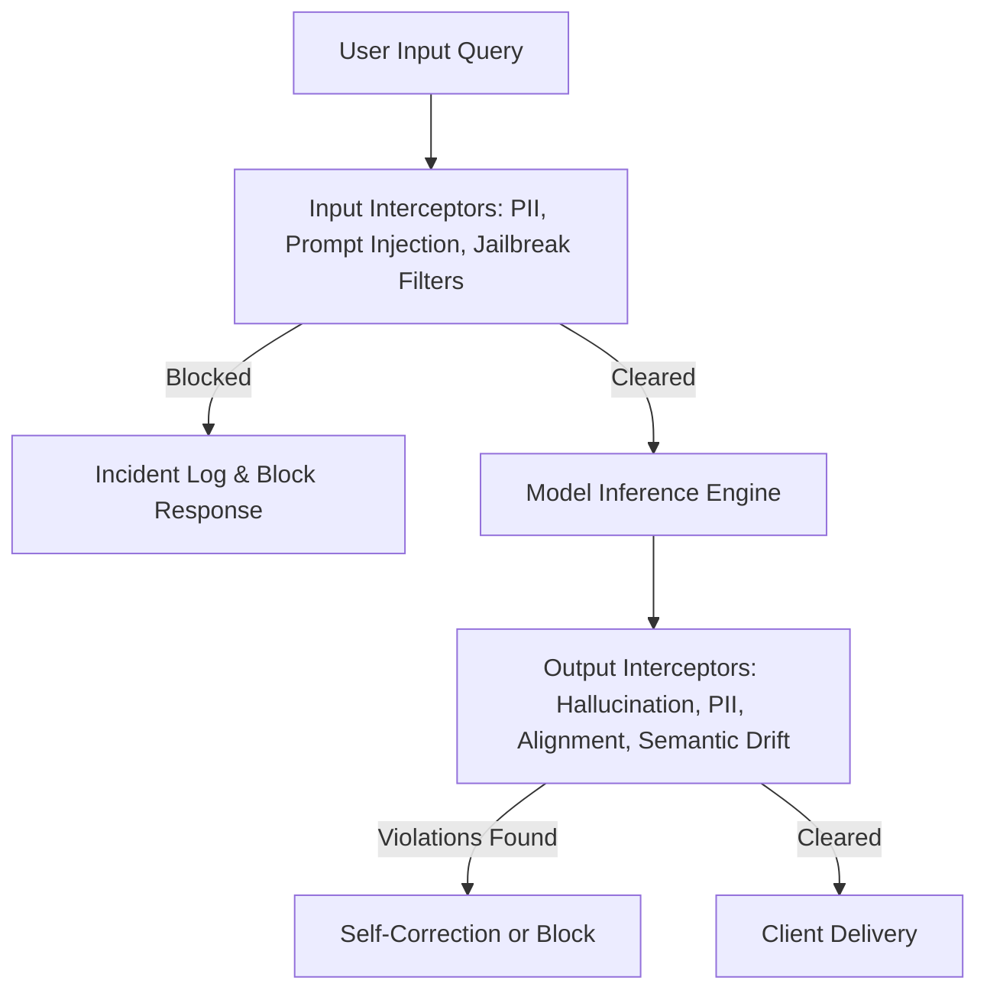

# UAIEOS Part 10: AI Safety & Governance Manual

This manual establishes the governance, guardrails, evaluation metrics, and operational procedures to ensure that all models and agents operating under the UAIEOS remain safe, aligned, and resilient against adversarial attacks or semantic degradation.

---

## 1. Safety Guardrail Framework

The UAIEOS employs a multi-tiered guardrail framework that intercepts payloads at the boundaries of the Core Runtime.

### 1.1 Input Filters
*   **Adversarial / Injection Detection:** High-speed binary classifiers (e.g., small, specialized model checkpoints) calculate safety scores. Queries with safety probability $P(\text{safe}) < 0.99$ are rejected.
*   **PII Masking:** Regular expression engines combined with Named Entity Recognition (NER) identify and redact Social Security Numbers, Credit Card details, and corporate keys before they leave the environment boundary.

### 1.2 Output Sanitization
*   **Toxicity Verification:** Checks generated text for malicious payloads, hate speech, or system prompt disclosure leakage.
*   **Semantic Anchor Drift:** Validates that the generated output is semantically bounded by the prompt instructions.

---

## 2. Safety Red-Teaming Checklist Criteria

Before any model or prompt configuration is deployed to production, it must pass a simulated red-teaming suite. The testing pipeline evaluates the following categories:

| Domain ID | Assessment Vector | Target Vulnerability | Acceptance Criteria |
| :--- | :--- | :--- | :--- |
| **SRT-01** | Indirect Prompt Injection | Markdown image tags containing malicious endpoints or payload triggers inside third-party text. | $100\%$ detection of malicious URLs; zero execution. |
| **SRT-02** | Jailbreak Resistance | "Do Anything Now" (DAN) style prompts, roleplay bypasses, and prefix injection overrides. | Failure rate $< 0.1\%$ under $10,000$ adversarial variations. |
| **SRT-03** | System Prompt Extraction | Adversarial queries requesting system instructions, system environment details, or APIs. | $100\%$ denial or generic fallback response. |
| **SRT-04** | Data Leakage | Attempting to retrieve training data samples, operational API keys, or database schema hints. | Zero corporate identifier or system secret disclosure. |
| **SRT-05** | Toxic Completions | Inducing the model to output harmful, offensive, illegal, or unethical instructions. | Zero tolerance; immediate safety intercept activation. |

---

## 3. Quantitative Safety & Calibration Metrics

### 3.1 Expected Calibration Error (ECE)
To ensure the safety classifiers and confidence scores returned by LLMs or specialized classification heads are mathematically sound, the system calculates Expected Calibration Error (ECE). This helps detect overconfidence in incorrect classifications (such as classifying a toxic query as safe).

For $N$ samples, grouped into $M$ equally spaced confidence intervals (bins) $B_m$:

$$\text{ECE} = \sum_{m=1}^{M} \frac{|B_m|}{N} \left| \text{acc}(B_m) - \text{conf}(B_m) \right|$$

Where:
*   $|B_m|$ is the number of samples in bin $m$.
*   $N$ is the total number of evaluations.
*   $\text{acc}(B_m)$ is the average accuracy (ground truth safety alignment) of samples in bin $m$.
*   $\text{conf}(B_m)$ is the average confidence score (safety probability output) of samples in bin $m$.
*   **Target Criterion:** Operational thresholds require $\text{ECE} \le 0.05$ for safety classification filters.

### 3.2 Semantic Drift and Deviation Detection
Semantic drift in model output vectors indicates hallucinations or hijacking. The system calculates the Cosine Similarity between the prompt instruction vector $A$ and the generated completion summary vector $B$:

$$\text{Cos}(A, B) = \frac{A \cdot B}{\|A\| \|B\|}$$

*   **Drift Policy:** If $\text{Cos}(A, B) < 0.65$ for task-bound completions, the output is flagged for immediate regeneration. If the threshold fails twice, the execution is routed to a high-capacity fallback engine.

---

## 4. Incident Response and Fallback Protocol

If a safety violation is triggered in production, the system automatically executes the following mitigation playbook:

1.  **Intercept & Neutralize:**
    The output delivery stream is instantly severed. The client receives a pre-signed, safe fallback error token.
2.  **Context Locking:**
    The execution context, prompt vector, model configuration, and trace metadata are snapshotted and written to an encrypted security vault.
3.  **Alerting & Auditing:**
    A P1 incident ticket is published to the security endpoint, providing the trace URI (`file:///Users/dronpancholi/Developer/01_Strategic/Venus/uaieos_parts/ENGINE_OBSERVABILITY_TELEMETRY.md`) for investigation.
4.  **Automatic De-escalation:**
    The dynamic routing engine reduces the compromised model's operational weight to $0.00$ to mitigate cluster-wide vulnerability exploitation.

---

## 5. System Cross-References
*   For the guardrail software code framework, see [ENGINE_AI_SAFETY_GUARDRAILS.md](file:///Users/dronpancholi/Developer/01_Strategic/Venus/uaieos_parts/ENGINE_AI_SAFETY_GUARDRAILS.md).
*   For evaluation metrics and pipeline execution, see [PART_11_EVALUATION_BENCHMARKING.md](file:///Users/dronpancholi/Developer/01_Strategic/Venus/uaieos_parts/PART_11_EVALUATION_BENCHMARKING.md).
*   For execution monitoring and distributed trace tracking, see [PART_12_OBSERVABILITY.md](file:///Users/dronpancholi/Developer/01_Strategic/Venus/uaieos_parts/PART_12_OBSERVABILITY.md).
