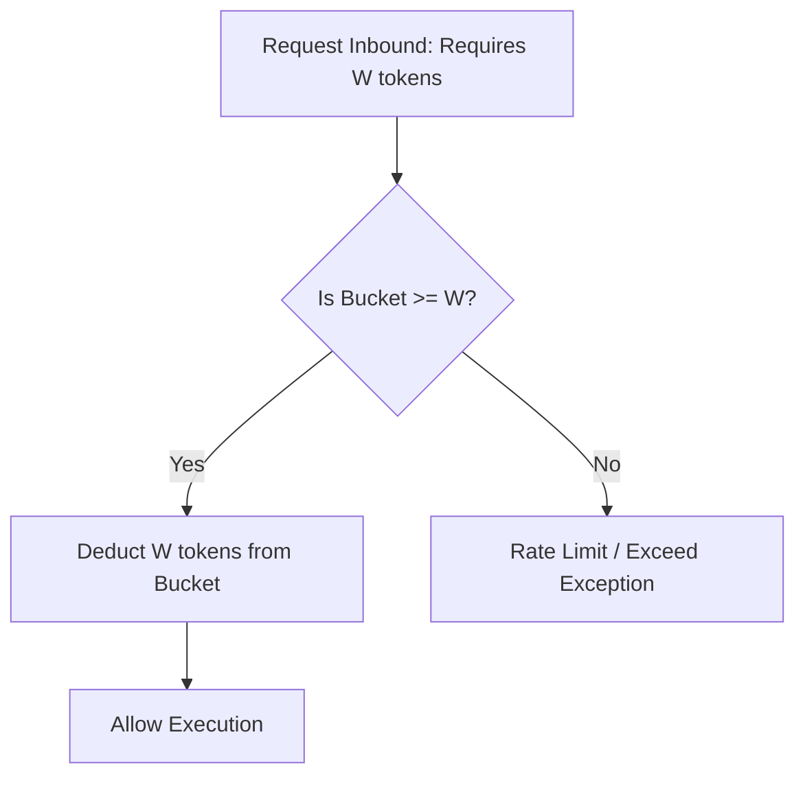

# UAIEOS Part 13: AI Economics Manual

This manual details the cost models, cache optimization algorithms, rate-limiting frameworks, and financial operations principles that govern LLM computation budgets within the UAIEOS.

---

## 1. Token Cost Model and Execution Overhead

The financial impact of any model transaction is calculated using a multi-factor token pricing formula that accounts for prefix reuse, prompt caching, output density, and infrastructure network overhead.

### 1.1 Standard Financial Cost Equation
The operational cost $C_{\text{total}}$ of a single LLM invocation is defined as:

$$C_{\text{total}} = \left( P_{\text{in}} \cdot N_{\text{uncached}} + P_{\text{cache}} \cdot N_{\text{cached}} + P_{\text{out}} \cdot N_{\text{out}} \right) \cdot (1 + \mu) + C_{\text{fixed}}$$

Where:
*   $P_{\text{in}}$: Unit price per input token (uncached).
*   $N_{\text{uncached}}$: Number of uncached input tokens parsed.
*   $P_{\text{cache}}$: Unit price per cached input token (typically $10\%$ to $50\%$ of $P_{\text{in}}$).
*   $N_{\text{cached}}$: Number of input tokens read directly from the provider's context cache.
*   $P_{\text{out}}$: Unit price per output token generated.
*   $N_{\text{out}}$: Number of generated output tokens.
*   $\mu$: Infrastructure multiplier representing networking, routing, and telemetry hosting overhead (dimensionless, e.g., $0.05$ for $5\%$ surcharge).
*   $C_{\text{fixed}}$: Fixed platform overhead cost per API transaction (e.g., $0.0001\text{ USD}$ for gateway operations).

---

## 2. Token Cost Caching & Prefix Caching Algorithms

To maximize the usage of $N_{\text{cached}}$, the UAIEOS dynamic router implements structured prefix caching.

### 2.1 Prompt Prefix Matching Algorithm
For a series of system directives $S$ and dynamic context payloads $D$, the system parses incoming requests to partition the prompt:

```
Prompt = [System Prompt (Static)] + [System Tools (Static)] + [Workflow History (Semi-Static)] + [User Input (Dynamic)]
```

The system ensures that the leading static components are aligned to the provider's cache block boundary (e.g., blocks of $2048$ tokens for Gemini and Claude). The cache manager intercepts prompts and maintains a local cache lookup index:

```
Let PromptHash = SHA-256(StaticPrefix)
If PromptHash is in LocalGatewayCache:
   Assert Cache Status to Router
Else:
   Warm cache by performing minor validation run or routing to premium cache-enabled cluster.
```

---

## 3. Budget Enforcement & Rate-Limiting

The UAIEOS prevents runaway agentic loops and denial-of-service vector escalations by implementing token bucket rate limiters at the user, agent, and tenant levels.

### 3.1 Token Bucket Algorithm
The system maintains a token bucket for each agent containing capacity $B$ (maximum burst budget) and a fill rate $r$ (tokens replenished per second).



At any timestamp $t$, the current bucket size $S(t)$ is computed prior to evaluating consumption requirements:

$$S(t) = \min\left( B, S(t_{\text{last}}) + r \cdot (t - t_{\text{last}}) \right)$$

If $S(t) \ge W$ (where $W$ is the projected token size of the request), execution is authorized and:

$$S(t_{\text{new}}) = S(t) - W$$

*   **Policy Thresholds:** Default agent allocations are restricted to $B = 500,000\text{ tokens}$ and $r = 10,000\text{ tokens/sec}$.

---

## 4. ROI Calculations for Multi-Agent Loops and Execution Pruning

For recursive agent loops (e.g., coding debugging loops), cost-to-benefit returns diminish exponentially. The UAIEOS terminates operations when the Return on Investment (ROI) of additional loops falls below a baseline threshold.

Let $V(i)$ be the quality metric (e.g., test pass percentage) at loop iteration $i$, and $C_{\text{cumulative}}(i)$ be the total cost incurred up to iteration $i$.

$$\text{ROI}(i) = \frac{V(i) - V(i-1)}{C_{\text{cumulative}}(i) - C_{\text{cumulative}}(i-1)}$$

*   **Pruning Decision Rule:** If $\text{ROI}(i) < \epsilon$ (where $\epsilon = 0.02$ units per dollar) and $V(i) < 1.0$, the loop is dynamically pruned, halting further model execution and routing the process to a human-in-the-loop endpoint.

---

## 5. System Cross-References
*   To implement the token calculator and budget controller, see [ENGINE_AI_ECONOMICS.md](file:///Users/dronpancholi/Developer/01_Strategic/Venus/uaieos_parts/ENGINE_AI_ECONOMICS.md).
*   For state execution paths that track execution cost metrics, see [PART_09_WORKFLOW_ORCHESTRATION.md](file:///Users/dronpancholi/Developer/01_Strategic/Venus/uaieos_parts/PART_09_WORKFLOW_ORCHESTRATION.md).
*   For tracing schema definitions containing the cost and usage fields, see [PART_12_OBSERVABILITY.md](file:///Users/dronpancholi/Developer/01_Strategic/Venus/uaieos_parts/PART_12_OBSERVABILITY.md).
