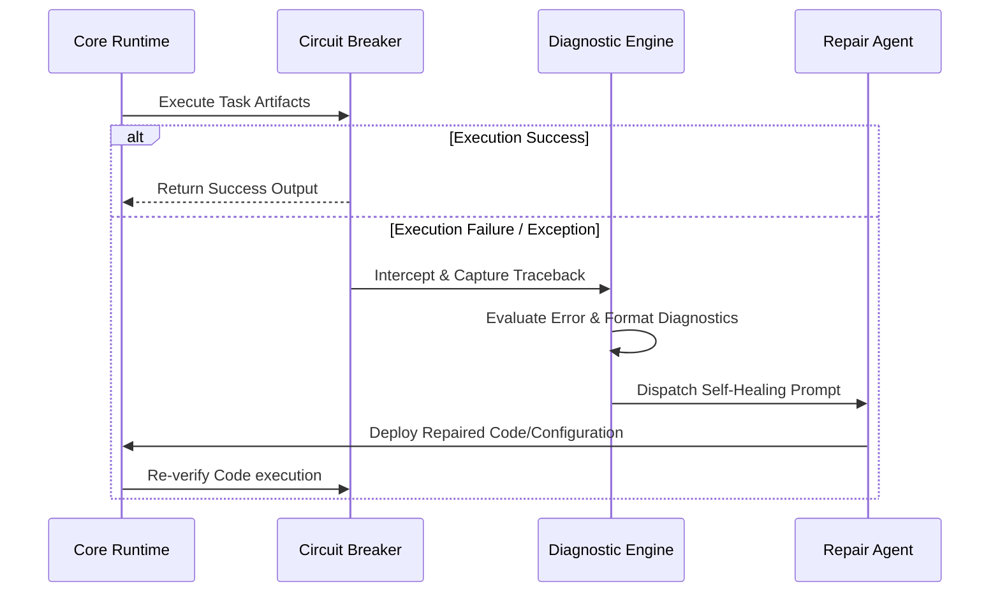

# UAIEOS Part 14: Autonomous AI Operations (AIOps) Manual

This manual specifies the protocols for self-healing execution loops, dynamic error categorization, automated code repair prompts, and failure circuit breakers within the UAIEOS.

---

## 1. Self-Healing Execution Loop Architecture

The UAIEOS implements a closed-loop execution pattern where runtime failures are automatically intercepted, categorized, and fed back to healing agents for recovery, minimizing human intervention.



---

## 2. Error Categorization & Fallback Routing

When a node or runtime pipeline throws an exception, the system parses the error type and maps it to specific recovery paths:

| Error Category | Indicators | Recovery Strategy | Fallback Route |
| :--- | :--- | :--- | :--- |
| **FATAL_SYNTAX** | `SyntaxError`, `IndentationError` | Immediate parsing via dynamic debugger. | `ENGINE_AUTONOMOUS_DEBUGGER.md` |
| **CONTEXT_EXCEEDED** | `TokenLimitExceeded`, `OutOfMemory` | Context compaction, message summarization, or model upgrades. | Upgraded high-context model gateway |
| **API_TIMEOUT** | `TimeoutError`, `HTTP_504` | Exponential backoff (max 3 retries) with jitter. | Alternative regional model endpoint |
| **HALLE_VIOLATION** | Low validation metrics (RAG, ECE, drift) | Prompt re-alignment, context re-extraction. | Secondary evaluation analyzer |

---

## 3. Self-Healing Runtime Prompt Specification

The following template defines the standard input schema generated by the Core Runtime when a failure occurs. The runtime inserts the exact context details, error log, and execution history before dispatching to the debugger model.

```markdown
# SYSTEM: SELF-HEALING RECOVERY DIRECTIVE
You are the UAIEOS Autonomous Repair Agent. An execution failure has occurred in the pipeline. Your task is to analyze the traceback, identify the root cause, and output the correct code payload inside a validated JSON response.

## EXECUTION CONTEXT
- **Target File Path:** file:///Users/dronpancholi/Developer/01_Strategic/Venus/uaieos_parts/ENGINE_CORE_RUNTIME.md
- **Active Method/Scope:** `RuntimeBootstrap.initialize_components`
- **Execution Step:** 4 (Middleware Initialization)

## RECOVERY GUIDELINES
1. DO NOT change imports or underlying engine interfaces unless explicitly listed in the traceback.
2. Ensure you preserve existing business logic while fixing the fault condition.
3. Validate that your output contains no syntax errors or unescaped characters.

## RUNTIME EXCEPTION TRACEBACK
```stderr
Traceback (most recent call last):
  File "engine_core_runtime.py", line 142, in initialize_components
    middleware.configure_routing(self.config.routing_matrix)
  File "middleware/routing.py", line 89, in configure_routing
    TypeError: 'NoneType' object is not iterable: expected list for 'routing_matrix'
```

## REPAIR RESPONSE SCHEMA
You MUST output your response strictly in the following JSON format:
{
  "explanation": "<Step-by-step diagnostic of the error>",
  "root_cause": "<Identified bug mechanism>",
  "remediation": "<Description of code fix>",
  "corrected_code": "<Raw replacement code block>"
}
```

---

## 4. Infinite Loop Detection & Circuit Breakers

To prevent infinite recursion (where an agent continually generates broken patches that fail compilation in an infinite loop), the runtime maintains a counter-measure state.

### 4.1 Loop Detection Equation
For any task $T$, the system computes the similarity of the consecutive errors generated:

$$\Delta E = \text{Cos}(e_i, e_{i-1})$$

Where $e_i$ is the embedding of the error string at iteration $i$.

If $\Delta E \ge 0.95$ (indicating the error output has stabilized on the same failure mode) for more than $3$ iterations, the **State Circuit Breaker** is tripped:

```
IF (Attempts(Task) > MaxAttempts) OR (ErrorSimilarityCount > 3):
    Transition State to 'CIRCUIT_TRIPPED'
    Halt Model Calls for target execution ID
    Write Incident Log
    Raise OperationalException("Self-Healing Circuit Breaker Activated: Infinite loop detected.")
```

---

## 5. System Cross-References
*   To implement the execution handler and traceback parser, see [ENGINE_AUTONOMOUS_DEBUGGER.md](file:///Users/dronpancholi/Developer/01_Strategic/Venus/uaieos_parts/ENGINE_AUTONOMOUS_DEBUGGER.md).
*   For the core runtime middleware interface definitions, see [ENGINE_CORE_RUNTIME.md](file:///Users/dronpancholi/Developer/01_Strategic/Venus/uaieos_parts/ENGINE_CORE_RUNTIME.md).
*   For the error trace logging infrastructure, see [PART_12_OBSERVABILITY.md](file:///Users/dronpancholi/Developer/01_Strategic/Venus/uaieos_parts/PART_12_OBSERVABILITY.md).
