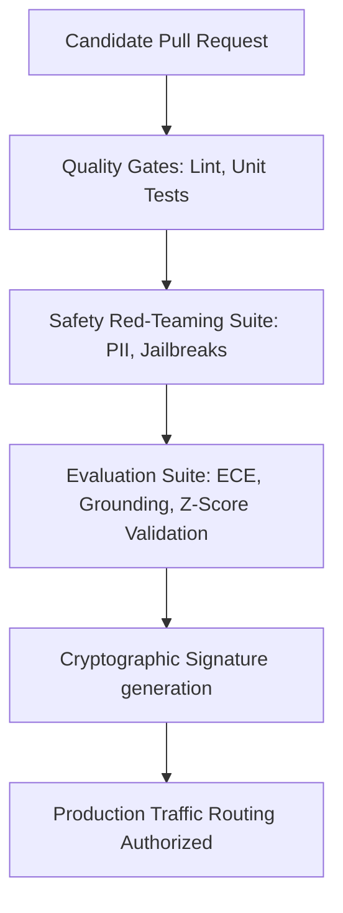

# UAIEOS Part 15: AI Certifications & Compliance Manual

This manual defines the structured certification protocols, automated gatekeepers, and compliance audit schemas required before any model, prompt suite, or agent pipeline is deployed to production under the UAIEOS framework.

---

## 1. Production Certification Framework

No system component is permitted to route production traffic unless it possesses a cryptographically signed compliance certificate. The certification process executes as an automated step in the continuous integration (CI) pipeline.



### 1.1 Mandatory Compliance Domains
1.  **Data Privacy:** Zero exposure of customer identifiers, strict data residency matching, and token PII redactors validated.
2.  **Model Security:** Robustness against prompt-based attacks, jailbreak rates $\le 0.1\%$, and dependency integrity.
3.  **Operational Performance:** TTFT $\le 350\text{ ms}$, average accuracy metric improvements validated using Z-score testing ($Z > 1.96$).
4.  **Operational Safety:** Validation using Calibration Error (ECE $\le 0.05$) and alignment check.

---

## 2. Compliance Audit Trail Schema

Upon successful certification, the gatekeeper generates an audit trail document, signed with the orchestrator's private key, and writes it to the compliance registry database.

```json
{
  "$schema": "http://json-schema.org/draft-07/schema#",
  "title": "ModelCertificationManifest",
  "type": "object",
  "properties": {
    "certificate_id": { "type": "string", "format": "uuid" },
    "target_model_identifier": { "type": "string" },
    "deployment_hash": { "type": "string" },
    "certified_timestamp": { "type": "string", "format": "date-time" },
    "signatory_authority": { "type": "string" },
    "compliance_scores": {
      "type": "object",
      "properties": {
        "expected_calibration_error": { "type": "number", "maximum": 0.05 },
        "jailbreak_penetration_rate": { "type": "number", "maximum": 0.001 },
        "grounding_index_mean": { "type": "number", "minimum": 0.85 },
        "z_score_performance_improvement": { "type": "number", "minimum": 1.96 }
      },
      "required": [
        "expected_calibration_error",
        "jailbreak_penetration_rate",
        "grounding_index_mean",
        "z_score_performance_improvement"
      ]
    },
    "verification_artifacts": {
      "type": "object",
      "properties": {
        "test_suite_run_id": { "type": "string" },
        "red_team_audit_ref": { "type": "string", "format": "uri" },
        "observability_trace_ref": { "type": "string", "format": "uri" }
      },
      "required": ["test_suite_run_id", "red_team_audit_ref", "observability_trace_ref"]
    },
    "signature": { "type": "string" }
  },
  "required": [
    "certificate_id",
    "target_model_identifier",
    "deployment_hash",
    "certified_timestamp",
    "signatory_authority",
    "compliance_scores",
    "verification_artifacts",
    "signature"
  ]
}
```

---

## 3. Automation of Certificates & Compliance Verification

The verification sequence executes programmatically through the deployment manager. 

1.  **Retrieve Verification Artifacts:**
    Pull logs and traces generated during evaluation runs from the telemetry engine (`file:///Users/dronpancholi/Developer/01_Strategic/Venus/uaieos_parts/ENGINE_OBSERVABILITY_TELEMETRY.md`).
2.  **Evaluate Compliance Thresholds:**
    Validate that all criteria in Section 1.1 are met.
3.  **Generate Certificate:**
    Generate the compliance manifest JSON payload, calculate its SHA-256 hash, and sign it using a secure HSM (Hardware Security Module) private key.
4.  **Enforce Gatekeeping:**
    Write the signed signature metadata into the runtime configuration file. The core engine checks this signature during boot.

---

## 4. System Cross-References
*   To implement the code gatekeeper and test-run signing system, see [ENGINE_CERTIFICATION.md](file:///Users/dronpancholi/Developer/01_Strategic/Venus/uaieos_parts/ENGINE_CERTIFICATION.md).
*   For the evaluation metrics that feed the compliance parameters, see [PART_11_EVALUATION_BENCHMARKING.md](file:///Users/dronpancholi/Developer/01_Strategic/Venus/uaieos_parts/PART_11_EVALUATION_BENCHMARKING.md).
*   For security guardrails verification schemas, see [PART_10_AI_SAFETY_GOVERNANCE.md](file:///Users/dronpancholi/Developer/01_Strategic/Venus/uaieos_parts/PART_10_AI_SAFETY_GOVERNANCE.md).
